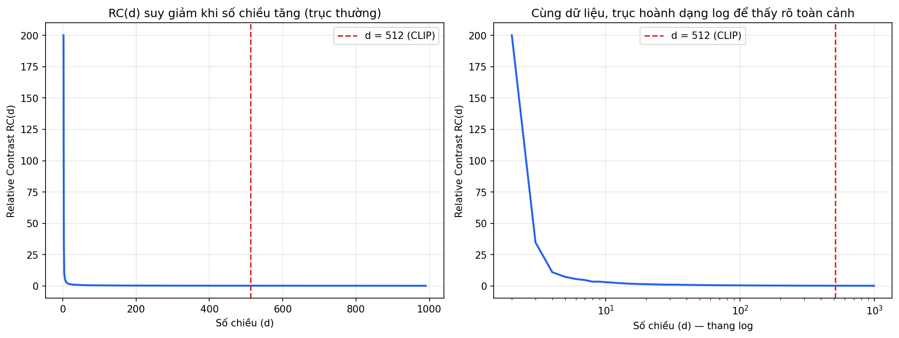

# PHẦN I — CLIP LÀ GÌ

## 1. Định nghĩa và nguồn gốc

CLIP (Contrastive Language–Image Pre-training) là một mô hình học sâu do OpenAI công bố năm 2021, được thiết kế để học mối liên hệ ngữ nghĩa giữa hình ảnh và văn bản. Khác với các mô hình thị giác máy tính truyền thống được huấn luyện để phân loại ảnh vào một tập nhãn cố định định trước (ví dụ 1000 lớp của ImageNet), CLIP được huấn luyện trên 400 triệu cặp (ảnh, văn bản mô tả) thu thập trực tiếp từ Internet — không cần con người ngồi gán nhãn thủ công theo một danh mục cố định.

Kết quả của quá trình huấn luyện này là một không gian vector chung, nơi ảnh và văn bản có nội dung liên quan đến nhau sẽ nằm gần nhau, còn ảnh và văn bản không liên quan sẽ nằm xa nhau — bất kể chúng đến từ hai loại dữ liệu hoàn toàn khác nhau về bản chất.

## 2. Bối cảnh ra đời — khoảng trống mà CLIP lấp đầy

Trước khi CLIP xuất hiện, việc truy hồi thông tin bằng ảnh và bằng văn bản tồn tại như hai trường phái tách biệt, mỗi bên phát triển độc lập và không có cầu nối tự nhiên giữa chúng.

**Trường phái thứ nhất — Content-Based Image Retrieval (CBIR).** Đây là hướng trích xuất đặc trưng thị giác của ảnh thành vector số học, khởi đầu bằng đặc trưng thủ công thời kỳ đầu như color histogram hay SIFT, sau này chuyển sang đặc trưng học sâu qua CNN hoặc ViT. Nhược điểm cố hữu của toàn bộ trường phái này, bất kể phương pháp trích xuất đặc trưng cụ thể là gì, nằm ở chỗ nó "mù ngôn ngữ" — không có khả năng liên kết trực tiếp nội dung ảnh với một câu mô tả tự nhiên nếu không đi qua một bước gán nhãn trung gian do con người thực hiện.

**Trường phái thứ hai — Lexical hay Text-based Retrieval.** Đây là hướng xử lý văn bản thuần túy, dựa trên các thuật toán đánh chỉ mục và xếp hạng theo tần suất từ như BM25 hay TF-IDF. Về mặt biểu diễn dữ liệu, trường phái này thuộc nhóm sparse retrieval — vector biểu diễn có số chiều bằng đúng kích thước từ điển, và phần lớn giá trị trong vector đó bằng không, chỉ khác không ở đúng những từ khóa xuất hiện. Nhược điểm của cách tiếp cận này là không hiểu được đồng nghĩa — tìm bằng từ "xe hơi" sẽ không khớp được với văn bản chỉ chứa từ "ô tô" nếu hai từ này chưa từng được liên kết tường minh.

**CLIP dung hợp cả hai trường phái này** bằng cách đưa đồng thời ảnh và văn bản vào cùng một không gian vector đặc (dense vector), thay vì để chúng tồn tại trong hai thế giới biểu diễn tách biệt. Đây thuộc nhóm dense retrieval liên phương thức (cross-modal) — khác hẳn cả CBIR thuần ảnh lẫn lexical search thuần văn bản, vì nó cho phép so sánh trực tiếp độ liên quan giữa một ảnh và một câu văn bản bất kỳ, điều mà cả hai trường phái tiền nhiệm đều không làm được.

## 3. CLIP thuộc phân loại bài toán nào trong Machine Learning

CLIP không phải là một bài toán Classification theo nghĩa cổ điển. Nó không có một tập nhãn cố định được định nghĩa trước, và cũng không có một lớp fully-connected kết hợp softmax cuối cùng để chọn ra đúng một nhãn trong số N nhãn đã biết. Thay vào đó, CLIP thuộc về giao điểm của hai phạm trù sau, chồng lấn lên nhau:

**Self-supervised Representation Learning.** "Nhãn" của CLIP, theo một nghĩa mở rộng, chính là câu văn bản mô tả đi kèm ảnh, vốn đã có sẵn một cách tự nhiên trên Internet — không cần con người ngồi gán nhãn theo một hệ thống phân loại (taxonomy) được thiết kế trước. Đây là lý do gọi là "tự giám sát": tín hiệu giám sát tồn tại sẵn trong chính cấu trúc dữ liệu, không cần con người can thiệp thủ công theo từng mẫu.

**Metric Learning, hay Similarity/Distance Learning.** Mục tiêu huấn luyện của CLIP không phải là học cách phân loại đúng một đối tượng vào một lớp, mà là học ra một không gian vector (metric space) nơi khoảng cách hoặc độ tương đồng giữa hai điểm bất kỳ phản ánh đúng mức độ liên quan về ngữ nghĩa giữa chúng. Đây chính là mục tiêu phục vụ trực tiếp cho bài toán truy hồi (retrieval) — tìm ra k đối tượng gần nhất với một truy vấn cho trước — hoàn toàn khác với mục tiêu của bài toán classification là chọn đúng một nhãn duy nhất.

Bảng dưới đây đặt CLIP trong bức tranh phân loại rộng hơn của Machine Learning, mở rộng so với ba loại bài toán quen thuộc là hồi quy, phân loại, và phân cụm:

| Nhóm lớn | Bài toán con | Đặc điểm |
|---|---|---|
| Supervised | Regression | Dự đoán một giá trị liên tục |
| Supervised | Classification | Dự đoán một nhãn rời rạc trong một tập cố định |
| Unsupervised | Clustering | Nhóm dữ liệu không có nhãn thành các cụm |
| Unsupervised | Dimensionality Reduction | Giảm số chiều dữ liệu, giữ lại thông tin quan trọng |
| Self-supervised | Representation Learning | Tự tạo tín hiệu giám sát từ cấu trúc dữ liệu sẵn có — **CLIP thuộc nhóm này** |
| Metric Learning | Similarity/Distance Learning | Học một không gian mà khoảng cách phản ánh đúng độ tương đồng — **CLIP cũng thuộc nhóm này** |

## 4. Vì sao cách phân loại này tạo ra khả năng Zero-shot

Đây là hệ quả trực tiếp và quan trọng nhất của việc CLIP không thuộc nhóm Classification cổ điển.

Một mô hình Classification học một ranh giới quyết định cứng (decision boundary) giữa các lớp đã biết trước. Khi gặp một khái niệm nằm ngoài tập nhãn đã học — gọi là tình huống closed-set — mô hình hoàn toàn bó tay, và trong thực tế triển khai, nó buộc phải ép kết quả vào một trong các lớp đã biết, dù kết quả đó sai.

CLIP học một hàm đo độ tương đồng ngữ nghĩa tổng quát trong một không gian liên tục, không bị giới hạn bởi bất kỳ tập nhãn cố định nào. Vì "nhãn" của nó chính là câu văn bản tự nhiên — với số lượng cách diễn đạt gần như vô hạn — CLIP buộc phải học một biểu diễn đủ tổng quát để có thể so khớp với bất kỳ mô tả nào, kể cả những khái niệm mà nó chưa từng thấy trong quá trình huấn luyện. Đây chính là khả năng zero-shot, hay còn gọi là open-vocabulary classification: muốn "phân loại" một ảnh thuộc về khái niệm gì, chỉ cần đưa câu mô tả khái niệm đó vào Text Encoder ngay tại thời điểm suy luận, không cần huấn luyện lại, không cần bất kỳ lớp softmax cố định nào gắn với một tập nhãn định sẵn.

Chính đặc tính này là nền tảng lý thuyết trực tiếp cho một quyết định quan trọng trong việc áp dụng CLIP vào một hệ thống truy hồi thực tế: sử dụng mô hình CLIP nguyên bản đã huấn luyện sẵn, không tinh chỉnh lại (fine-tune) trên một tập dữ liệu nhỏ mang tính đặc thù — vì sức mạnh cốt lõi của CLIP nằm chính ở khả năng tổng quát hoá này, và việc tinh chỉnh trên một phạm vi hẹp có nguy cơ thu hẹp lại chính không gian ngữ nghĩa rộng lớn đã học được, đi ngược lại lý do khiến CLIP trở thành lựa chọn phù hợp ngay từ đầu. Lập luận đầy đủ về vấn đề này sẽ được trình bày chi tiết ở phần cuối của tài liệu.

---

# PHẦN II — NGUYÊN LÝ HOẠT ĐỘNG VÀ CẤU TẠO CỦA CLIP

## 1. Kiến trúc tổng thể

CLIP gồm hai thành phần độc lập gọi là hai bộ mã hóa (encoder), hoạt động hoàn toàn tách biệt với nhau trong suốt quá trình xử lý, chỉ "gặp nhau" tại bước cuối cùng khi so sánh kết quả. Bộ mã hóa ảnh (Image Encoder) tiếp nhận một ảnh và chuyển hóa nó thành một vector số học. Bộ mã hóa văn bản (Text Encoder) tiếp nhận một câu văn bản và chuyển hóa nó thành một vector khác. Điểm mấu chốt: dù xử lý hai loại dữ liệu có bản chất hoàn toàn khác nhau, cả hai bộ mã hóa đều xuất ra vector có cùng số chiều — 512 chiều trong phiên bản ViT-B/32 — và cùng được đặt vào chung một không gian vector duy nhất, gọi là không gian biểu diễn chung (shared embedding space).

Chính vì hai vector này cùng nằm trong một không gian chung, ta có thể đo độ liên quan giữa bất kỳ một ảnh nào và bất kỳ một câu văn bản nào chỉ bằng một phép toán đơn giản: tính độ tương đồng cosine giữa hai vector tương ứng.

## 2. Hai bộ mã hóa — vì sao tách biệt hoàn toàn

**Image Encoder** có kiến trúc Vision Transformer (ViT). Ảnh đầu vào được chia thành các mảng nhỏ đều nhau gọi là patch — ví dụ ảnh 224×224 pixel chia thành các patch 32×32 sẽ cho ra 49 patch — mỗi patch được xem như một "token" đưa vào cơ chế self-attention để học quan hệ không gian giữa các vùng khác nhau trong ảnh.

**Text Encoder** có kiến trúc Transformer thuần túy, giống kiến trúc dùng trong các mô hình ngôn ngữ. Câu văn bản đầu vào được tách thành các token theo thuật toán Byte Pair Encoding (BPE), rồi đưa vào cơ chế self-attention để học quan hệ tuần tự và ngữ pháp giữa các từ.

Lý do hai bộ mã hóa phải tách biệt hoàn toàn, không dùng chung một mạng duy nhất xử lý cả hai loại input, đến từ hai tầng nguyên nhân:

**Tầng thứ nhất — bản chất dữ liệu khác nhau.** Ảnh là dữ liệu dạng lưới liên tục (pixel RGB), văn bản là dữ liệu rời rạc dạng chuỗi (token). Hai loại cấu trúc toán học này đòi hỏi hai loại thiên kiến quy nạp (inductive bias) khác nhau ngay từ tầng kiến trúc: ViT cần cơ chế nắm bắt quan hệ không gian hai chiều giữa các patch, còn Transformer văn bản cần cơ chế nắm bắt quan hệ tuần tự một chiều giữa các token.

**Tầng thứ hai — yêu cầu của hệ thống truy hồi, đây là lý do trực tiếp và thực dụng nhất.** Kiến trúc hai bộ mã hóa tách biệt (dual-encoder) cho phép mã hóa độc lập rồi lưu sẵn vector (pre-compute) — toàn bộ ảnh trong cơ sở dữ liệu chỉ cần được mã hóa đúng một lần, lưu vào cơ sở dữ liệu vector, sau đó mỗi lần truy vấn chỉ cần mã hóa riêng câu truy vấn rồi so sánh cosine similarity với các vector đã lưu sẵn — không cần chạy lại toàn bộ mô hình cho mỗi lượt tìm kiếm. Đây là điều kiện bắt buộc để một hệ thống truy hồi ở quy mô lớn có thể vận hành với tốc độ chấp nhận được.

Đối lập với kiến trúc dual-encoder là kiến trúc fusion encoder (ví dụ ViLT, BEiT-3), nơi patch ảnh và token văn bản được đưa vào chung một chuỗi input duy nhất, xử lý bởi một Transformer duy nhất ngay từ lớp đầu tiên — cho phép attention "nhìn" được cả hai phương thức đồng thời, bắt được quan hệ tinh vi hơn, nhưng đổi lại không thể pre-compute được vì luôn cần cả ảnh lẫn văn bản có mặt cùng lúc để chạy mô hình. Đây là lý do kiến trúc dual-encoder của CLIP khớp trực tiếp với yêu cầu của một hệ thống truy hồi quy mô lớn, không phải một lựa chọn ngẫu nhiên.

## 3. Cơ chế học tương phản (Contrastive Learning)

Quá trình huấn luyện CLIP dựa trên nguyên lý học tương phản. Trong một lô huấn luyện (batch) gồm N cặp (ảnh, văn bản), CLIP tính ra một ma trận độ tương đồng cosine kích thước N×N giữa toàn bộ N ảnh và toàn bộ N văn bản trong batch đó. Trên đường chéo chính của ma trận này là N cặp đúng — ảnh và văn bản mô tả thật sự của nó — cần có độ tương đồng cao nhất. Toàn bộ N²−N ô còn lại, nằm ngoài đường chéo, là các cặp sai — cần bị đẩy xuống thấp.

Đây chính là ý nghĩa của từ "tương phản": mô hình học bằng cách so sánh một cặp đúng (positive pair) với hàng loạt cặp sai (negative pairs) trong cùng một batch, chứ không học từ một nhãn tuyệt đối cố định như trong bài toán classification.

**Vai trò của kích thước batch N.** N chính là số lượng cặp âm mà mỗi cặp dương phải cạnh tranh để được phân biệt. N càng lớn, bài toán "tìm đúng một cặp dương trong số N ứng viên" càng khó — nhưng đây là một tín hiệu học mang tính tích cực, thúc đẩy mô hình học được biểu diễn phân biệt tinh vi hơn, không phải nguyên nhân gây overfitting theo kiểu vẫn thường gặp ở học có giám sát thông thường. CLIP phiên bản gốc sử dụng N bằng 32768, một con số phản ánh giới hạn hạ tầng phần cứng tại thời điểm huấn luyện, không phải một giới hạn lý thuyết cố định.

## 4. Hàm mất mát InfoNCE

Kết quả của cơ chế học tương phản nói trên được lượng hóa thành một hàm mất mát cụ thể, gọi là InfoNCE, được tính theo hai chiều đối xứng nhau.

Chiều ảnh sang văn bản:
$$\mathcal{L}_{I \to T} = -\frac{1}{N}\sum_{i=1}^{N} \log \frac{\exp(\text{sim}(I_i, T_i)/\tau)}{\sum_{j=1}^{N} \exp(\text{sim}(I_i, T_j)/\tau)}$$

Chiều văn bản sang ảnh:
$$\mathcal{L}_{T \to I} = -\frac{1}{N}\sum_{i=1}^{N} \log \frac{\exp(\text{sim}(T_i, I_i)/\tau)}{\sum_{j=1}^{N} \exp(\text{sim}(T_i, I_j)/\tau)}$$

Hàm mất mát tổng của CLIP là trung bình cộng của hai chiều này:
$$\mathcal{L}_{CLIP} = \frac{1}{2}\left(\mathcal{L}_{I \to T} + \mathcal{L}_{T \to I}\right)$$

Bảng dưới đây bóc tách ý nghĩa từng thành phần trong công thức:

| Ký hiệu | Ý nghĩa |
|---|---|
| $I_i, T_i$ | Vector embedding của ảnh và văn bản thứ $i$, đã được chuẩn hóa L2 |
| $\text{sim}(I_i, T_j)$ | Độ tương đồng cosine giữa ảnh $i$ và văn bản $j$ — vì đã chuẩn hóa L2 nên phép này chính là tích vô hướng (dot product) |
| $N$ | Kích thước batch |
| $\tau$ | Tham số nhiệt độ (temperature), điều chỉnh độ "sắc nét" của phân phối softmax |
| Tử số | Độ tương đồng của đúng một cặp dương (nằm trên đường chéo ma trận) |
| Mẫu số | Tổng độ tương đồng của toàn bộ N ứng viên trong hàng hoặc cột — chính là phép chuẩn hóa softmax |

Về bản chất toán học, InfoNCE chính là phép softmax áp dụng lên ma trận độ tương đồng, kết hợp với hàm cross-entropy, trong đó "nhãn" tương ứng với vị trí trên đường chéo chính — một cấu trúc phát sinh tự nhiên từ chính cặp dữ liệu (ảnh, văn bản) đã có sẵn, không phải một nhãn phân loại (category label) do con người gán trước.

Việc tính loss theo cả hai chiều, thay vì chỉ một chiều duy nhất, là cần thiết vì softmax tính theo hàng (chuẩn hóa theo từng ảnh) và softmax tính theo cột (chuẩn hóa theo từng văn bản) là hai phép chuẩn hóa độc lập trên cùng một ma trận độ tương đồng — chúng chỉ trùng nhau đúng tại một phần tử duy nhất trên đường chéo, còn lại hoàn toàn khác nhau. Nếu chỉ tối ưu một chiều, mô hình có thể học tốt việc tìm văn bản đúng khi cho trước ảnh, nhưng lại không được tối ưu trực tiếp cho chiều ngược lại là tìm ảnh đúng khi cho trước văn bản.

## 5. Vai trò của tham số nhiệt độ τ — giới thiệu khái niệm

Tham số τ trong công thức trên chia độ tương đồng cosine trước khi đưa vào hàm softmax. Vì độ tương đồng cosine bị giới hạn trong một khoảng rất hẹp là [-1, 1] — khác hẳn với logits trong bài toán classification thông thường, vốn có thể nhận giá trị với biên độ tùy ý — nếu không có phép chia cho τ, chênh lệch giữa cặp đúng và cặp sai sau khi qua softmax sẽ rất nhỏ, khiến tín hiệu học (gradient) trở nên yếu.

CLIP không cố định τ theo một giá trị thủ công, mà để nó trở thành một tham số học được (learnable parameter) — được khởi tạo ở một mức an toàn, rồi để chính quá trình huấn luyện tự điều chỉnh dần theo thời gian, kèm theo một ràng buộc chặn giá trị để tránh τ trôi tới các mức cực trị gây mất ổn định huấn luyện.

Cơ chế toán học đầy đủ giải thích vì sao τ cần được xử lý cẩn trọng như vậy — cụ thể là điều gì xảy ra nếu τ bị đặt quá nhỏ ngay từ đầu quá trình huấn luyện — sẽ được trình bày chi tiết ở phần sau của tài liệu, khi phân tích các hệ quả toán học tất yếu phát sinh từ chính cấu trúc của CLIP.

---

# PHẦN III — XÂY DỰNG LẠI CLIP TỪ CON SỐ 0 BẰNG TOÁN HỌC

## Mở đầu: đặt lại đúng bài toán cần giải

Trước khi lắp ráp bất kỳ công thức nào, cần xác định rõ bài toán CLIP phải giải: cho một tập hợp ảnh và một tập hợp văn bản, cần tìm ra một cách biểu diễn sao cho có thể đo được, bằng một con số cụ thể, mức độ liên quan về nội dung giữa bất kỳ một ảnh nào và bất kỳ một văn bản nào. Toàn bộ những gì trình bày dưới đây là chuỗi quyết định toán học cần thiết, từng bước một, để đi từ phát biểu bài toán này tới đúng công thức InfoNCE đã thấy ở Phần II.

---

## Quyết định 1 — Cần một hàm ánh xạ dữ liệu thô thành đại lượng có thể so sánh được

**Vấn đề:** ảnh là một ma trận pixel, văn bản là một chuỗi ký tự. Không có phép toán nào định nghĩa sẵn "khoảng cách" giữa một ma trận pixel và một chuỗi ký tự — hai đối tượng này không sống trong cùng một không gian toán học.

**Lời giải:** cần hai hàm ánh xạ, gọi là $f_{img}$ và $f_{text}$, biến đổi ảnh $I$ và văn bản $T$ thành hai vector số học $f_{img}(I)$ và $f_{text}(T)$ có cùng số chiều $d$, cùng nằm trong không gian $\mathbb{R}^d$ — không gian mà phép đo khoảng cách hoặc độ tương đồng đã có định nghĩa toán học rõ ràng.

**Vì sao cần hai hàm riêng biệt, không dùng một hàm chung:** vì miền xác định (domain) của hai hàm này khác nhau hoàn toàn — $f_{img}$ nhận đầu vào là không gian ảnh, $f_{text}$ nhận đầu vào là không gian chuỗi token. Một hàm toán học chỉ có thể có một miền xác định; muốn xử lý hai miền khác nhau, buộc phải có hai hàm khác nhau.

**Ưu điểm của quyết định này:** cho phép mỗi hàm được tối ưu kiến trúc riêng cho đúng loại dữ liệu nó xử lý (ViT cho ảnh, Transformer cho văn bản), và quan trọng hơn, cho phép tính $f_{img}(I)$ độc lập với $f_{text}(T)$ — đây chính là nền tảng cho khả năng pre-compute đã trình bày ở Phần II.

**Nhược điểm:** vì $f_{img}$ và $f_{text}$ được khởi tạo và huấn luyện độc lập, không có gì đảm bảo hai không gian ảnh của chúng "tự nhiên" trùng khít lên nhau — đây chính là mầm mống toán học đầu tiên của hiện tượng modality gap, sẽ được chứng minh đầy đủ ở Phần IV.

---

## Quyết định 2 — Cần một phép đo độ liên quan không phụ thuộc độ lớn vector

**Vấn đề:** sau Quyết định 1, ta có hai vector $f_{img}(I)$ và $f_{text}(T)$. Cách đơn giản nhất để đo "độ liên quan" giữa chúng là tích vô hướng thô: $f_{img}(I) \cdot f_{text}(T)$. Nhưng tích vô hướng thô bị ảnh hưởng bởi độ lớn (norm) của từng vector — hai vector có hướng giống hệt nhau nhưng độ lớn khác nhau sẽ cho ra tích vô hướng khác nhau, dù về mặt ngữ nghĩa chúng "chỉ về cùng một hướng nội dung".

**Lời giải:** chuẩn hóa cả hai vector về độ dài đơn vị trước khi so sánh, bằng phép chuẩn hóa L2:

$$\hat{I} = \frac{f_{img}(I)}{\|f_{img}(I)\|_2} \qquad \hat{T} = \frac{f_{text}(T)}{\|f_{text}(T)\|_2}$$

Sau phép chuẩn hóa này, tích vô hướng giữa hai vector đơn vị chính là độ tương đồng cosine:

$$\text{sim}(I, T) = \hat{I} \cdot \hat{T} = \cos(\theta)$$

trong đó $\theta$ là góc giữa hai vector trong không gian $d$ chiều.

**Ưu điểm:** cosine similarity chỉ đo *hướng*, loại bỏ hoàn toàn ảnh hưởng của *độ lớn* — điều này phù hợp với trực giác ngữ nghĩa, vì một khái niệm "được nói mạnh hơn" (vector có độ lớn cao hơn) không nên tự động được coi là "liên quan hơn". Ngoài ra, giá trị luôn bị giới hạn trong đoạn $[-1, 1]$, tạo ra một thang đo có cận trên và cận dưới rõ ràng.

**Nhược điểm:** chính giới hạn $[-1, 1]$ lại là nguồn gốc trực tiếp của Quyết định 4 bên dưới — một khoảng giá trị hẹp như vậy gây khó khăn cho bước huấn luyện phía sau, buộc phải có thêm một cơ chế bù đắp.

---

## Quyết định 3 — Cần một cách so sánh một cặp đúng với nhiều cặp sai cùng lúc

**Vấn đề:** có $\text{sim}(I, T)$ cho một cặp cụ thể là chưa đủ để huấn luyện. Cần một cơ chế để nói với mô hình: "cặp này đúng, hãy tăng độ tương đồng của nó; những cặp kia sai, hãy giảm độ tương đồng của chúng". Có hai hướng khả dĩ để làm việc này.

**Hướng A — so từng cặp một (pairwise), ví dụ Triplet Loss:** với một cặp neo (anchor), một cặp dương (positive), một cặp âm (negative), tối ưu sao cho $\text{sim}(\text{anchor}, \text{positive}) - \text{sim}(\text{anchor}, \text{negative})$ lớn hơn một ngưỡng biên độ (margin) cho trước. Nhược điểm của hướng này: tại mỗi bước cập nhật, mô hình chỉ nhìn thấy đúng một cặp âm, tín hiệu học yếu; muốn học tốt cần một chiến lược chọn cặp âm khó (hard negative mining) riêng biệt, khá tốn công thiết kế.

**Hướng B — so một cặp đúng với toàn bộ N-1 cặp sai cùng lúc, đây là hướng CLIP chọn:** thay vì chỉ so với một cặp âm, so đồng thời với toàn bộ các cặp âm có sẵn ngay trong batch huấn luyện. Điều này đòi hỏi một cách chuẩn hóa nhiều giá trị đồng thời thành một phân phối xác suất — chính là hàm softmax:

$$p_i = \frac{\exp(\text{sim}(I_i, T_i))}{\sum_{j=1}^{N} \exp(\text{sim}(I_i, T_j))}$$

Sau đó áp dụng cross-entropy với "nhãn" là vị trí $i$ (cặp đúng):

$$\mathcal{L}_i = -\log(p_i)$$

**Ưu điểm của Hướng B:** tận dụng được toàn bộ N-1 cặp âm có sẵn trong batch mà không cần thiết kế thêm chiến lược chọn cặp âm nào — bản thân cấu trúc ngẫu nhiên của batch đã cung cấp đủ sự đa dạng. Đây là lý do CLIP mượn cơ chế softmax và cross-entropy từ bài toán classification, dù bản chất bài toán là metric learning chứ không phải phân loại.

**Nhược điểm:** chi phí tính toán tăng theo N² (phải tính toàn bộ ma trận N×N), và như đã đề cập ở Quyết định 2, sim(I,T) bị giới hạn trong $[-1,1]$ — một khoảng quá hẹp để hàm mũ $\exp$ tạo ra đủ độ tương phản giữa các giá trị.

---

## Quyết định 4 — Cần khuếch đại độ tương phản trước khi đưa vào softmax

**Vấn đề cụ thể phát sinh từ Quyết định 2 và 3 kết hợp lại:** giả sử có ba cặp trong batch với độ tương đồng cosine lần lượt là 0.5 (cặp đúng), 0.3 và 0.1 (hai cặp sai). Áp dụng thẳng softmax không qua bất kỳ điều chỉnh nào:

$$e^{0.5} \approx 1.649,\quad e^{0.3} \approx 1.350,\quad e^{0.1} \approx 1.105,\quad \text{tổng} \approx 4.104$$

$$p_{\text{đúng}} = \frac{1.649}{4.104} \approx 0.402$$

Xác suất gán cho cặp đúng chỉ khoảng 40%, dù giá trị cosine của nó đã cao hơn hẳn hai cặp còn lại — tín hiệu phân biệt vẫn còn khá mờ nhạt, gradient sinh ra từ đó cũng yếu tương ứng.

**Lời giải:** chia độ tương đồng cho một tham số $\tau$ nhỏ hơn 1 trước khi đưa vào softmax:

$$p_i = \frac{\exp(\text{sim}(I_i, T_i)/\tau)}{\sum_{j=1}^{N}\exp(\text{sim}(I_i, T_j)/\tau)}$$

Với cùng ba giá trị trên, thử với $\tau = 0.1$:

$$\frac{0.5}{0.1} = 5,\quad \frac{0.3}{0.1} = 3,\quad \frac{0.1}{0.1} = 1$$

$$e^{5} \approx 148.4,\quad e^{3} \approx 20.1,\quad e^{1} \approx 2.7,\quad \text{tổng} \approx 171.2$$

$$p_{\text{đúng}} = \frac{148.4}{171.2} \approx 0.867$$

Cùng một bộ giá trị cosine gốc, sau khi chia cho $\tau = 0.1$, xác suất gán cho cặp đúng tăng từ khoảng 40% lên khoảng 87% — phân phối trở nên "sắc nét" hơn nhiều, tín hiệu gradient theo đó cũng mạnh hơn đáng kể.

**Ưu điểm:** giải quyết trực tiếp vấn đề độ tương phản yếu do giới hạn $[-1,1]$ của cosine similarity gây ra, giúp quá trình huấn luyện có tín hiệu học đủ mạnh để hội tụ hiệu quả.

**Nhược điểm — đây chính là điểm cần cân nhắc cẩn trọng:** nếu $\tau$ quá nhỏ, độ khuếch đại quá mạnh có thể biến ngay cả sự chênh lệch từ nhiễu ngẫu nhiên (chưa mang ý nghĩa thật) thành một phân phối xác suất cực đoan, gây ra hiện tượng bão hòa softmax và vanishing gradient — cơ chế toán học đầy đủ của vấn đề này được chứng minh chi tiết ở Phần IV. Đây là lý do CLIP không chọn cố định $\tau$ theo tay, mà để nó trở thành một tham số học được, tự điều chỉnh theo quá trình huấn luyện.

---

## Tổng hợp: ráp bốn quyết định thành công thức InfoNCE hoàn chỉnh

Ghép Quyết định 1 (hai hàm ánh xạ độc lập), Quyết định 2 (chuẩn hóa L2 và cosine similarity), Quyết định 3 (softmax trên toàn bộ N cặp trong batch, kết hợp cross-entropy), và Quyết định 4 (chia cho $\tau$ trước softmax), theo đúng thứ tự đã suy luận, ta thu được chính xác công thức đã thấy ở Phần II:

$$\mathcal{L}_{I \to T} = -\frac{1}{N}\sum_{i=1}^{N} \log \frac{\exp(\text{sim}(I_i, T_i)/\tau)}{\sum_{j=1}^{N} \exp(\text{sim}(I_i, T_j)/\tau)}$$

Không có thành phần nào trong công thức này xuất hiện một cách tùy tiện — mỗi ký hiệu, mỗi phép toán đều là lời giải cho một vấn đề cụ thể phát sinh từ chính bài toán gốc: hai hàm ánh xạ độc lập giải quyết vấn đề hai loại dữ liệu khác miền; chuẩn hóa L2 giải quyết vấn đề độ lớn vector gây nhiễu; softmax trên toàn batch giải quyết vấn đề tận dụng nhiều cặp âm cùng lúc; và $\tau$ giải quyết vấn đề độ tương phản yếu do chính cosine similarity gây ra ở bước trước đó. Việc tính thêm chiều $\mathcal{L}_{T \to I}$ đối xứng và lấy trung bình cộng hai chiều, như đã giải thích ở Phần II, hoàn tất công thức đầy đủ của hàm mất mát CLIP.

---

# PHẦN IV — HỆ QUẢ TOÁN HỌC TẤT YẾU (HIỆU ỨNG PHỤ)

Phần này chứng minh ba hiện tượng không phải do lỗi thiết kế, mà là hệ quả tất yếu, có thể chứng minh được bằng toán học, phát sinh trực tiếp từ chính các quyết định đã lập luận ở Phần III.

---

## 1. Modality Gap — khoảng cách giữa hai không gian ảnh và văn bản

### Hiện tượng quan sát được

Dù đã huấn luyện xong, vector ảnh và vector văn bản không hòa lẫn vào nhau trong không gian chung — chúng tạo thành hai "đám mây" tách biệt, cách nhau một khoảng cố định. Đây là phát hiện đã được ghi nhận trong nghiên cứu học thuật (Liang và cộng sự, 2022).

### Chứng minh nguyên nhân thứ nhất — hiệu ứng hình nón (cone effect)

Quay lại Quyết định 1 ở Phần III: hai hàm $f_{img}$ và $f_{text}$ được khởi tạo độc lập với các trọng số ngẫu nhiên ban đầu khác nhau. Với một mạng neural bất kỳ có trọng số khởi tạo ngẫu nhiên, có thể chứng minh rằng đầu ra của mạng đó có xu hướng tập trung trong một vùng hẹp của không gian đích, gọi là hình nón (cone), thay vì trải đều khắp không gian đó — đây là hệ quả của cách các phép nhân ma trận liên tiếp trong mạng neural khuếch đại độ tương quan giữa các đầu ra khi trọng số chưa được huấn luyện để phân biệt.

Vì $f_{img}$ và $f_{text}$ khởi tạo độc lập, hai hình nón này hình thành ở hai vị trí khác nhau trong không gian $\mathbb{R}^d$ ngay từ trước khi bất kỳ bước huấn luyện nào diễn ra. Quá trình tối ưu hàm InfoNCE sau đó chỉ kéo các cặp $(\hat{I}_i, \hat{T}_i)$ tương ứng lại gần nhau một cách *tương đối* — không có cơ chế nào trong công thức InfoNCE ép buộc toàn bộ hình nón ảnh phải trùng khít lên toàn bộ hình nón văn bản.

### Chứng minh nguyên nhân thứ hai — bản chất tối ưu ranking, không phải tối ưu giá trị tuyệt đối

Nhìn lại công thức đã xây ở Phần III:

$$\mathcal{L}_i = -\log \frac{\exp(\text{sim}(I_i, T_i)/\tau)}{\sum_{j=1}^{N}\exp(\text{sim}(I_i, T_j)/\tau)}$$

Hàm mất mát này đạt giá trị nhỏ (tốt) khi $p_i \to 1$, tức khi $\text{sim}(I_i, T_i)$ **lớn hơn tương đối** so với $\text{sim}(I_i, T_j)$ với mọi $j \neq i$. Không có số hạng nào trong công thức ép $\text{sim}(I_i, T_i)$ phải tiến gần tới giá trị tối đa lý thuyết là 1. Mô hình "thắng" bài toán tối ưu ngay khi đạt đúng thứ hạng, không cần thu hẹp khoảng cách tuyệt đối giữa hai hình nón.

### Ví dụ tính toán minh họa — hai mô hình có Loss giống hệt nhau nhưng khoảng cách tuyệt đối khác hẳn

Đây là phần chứng minh cụ thể nhất cho nguyên nhân thứ hai: bằng số liệu, cho thấy hàm InfoNCE hoàn toàn "hài lòng" với hai kịch bản có mức độ thu hẹp modality gap rất khác nhau, miễn thứ hạng tương đối được giữ đúng.

Xét một batch rút gọn N = 3, cố định τ = 0.1 cho cả hai kịch bản. Trong cả hai trường hợp, cặp đúng luôn ở vị trí 1.

**Kịch bản A — mô hình đã thu hẹp phần lớn khoảng cách giữa hai modal, similarity tuyệt đối cao:**

$$\text{sim} = [0.70,\ 0.20,\ 0.15]$$

Chia cho τ: $[7.0,\ 2.0,\ 1.5]$

$$e^{7.0}\approx1096.6,\ e^{2.0}\approx7.39,\ e^{1.5}\approx4.48,\ \text{tổng}\approx1108.5$$

$$p_1^{(A)} = \frac{1096.6}{1108.5} \approx 0.989$$

$$\mathcal{L}^{(A)} = -\log(0.989) \approx 0.011$$

**Kịch bản B — mô hình chưa thu hẹp nhiều khoảng cách giữa hai modal, similarity tuyệt đối thấp hơn hẳn, nhưng thứ hạng tương đối vẫn giữ đúng:**

$$\text{sim} = [0.35,\ 0.05,\ 0.02]$$

Chia cho τ: $[3.5,\ 0.5,\ 0.2]$

$$e^{3.5}\approx33.12,\ e^{0.5}\approx1.65,\ e^{0.2}\approx1.22,\ \text{tổng}\approx35.99$$

$$p_1^{(B)} = \frac{33.12}{35.99} \approx 0.920$$

$$\mathcal{L}^{(B)} = -\log(0.920) \approx 0.083$$

### Đọc kết quả

Similarity tuyệt đối của cặp đúng ở Kịch bản A (0.70) cao hơn gấp đôi Kịch bản B (0.35) — nói cách khác, Kịch bản A đại diện cho một mô hình đã thu hẹp modality gap tốt hơn nhiều. Nhưng giá trị loss của hai kịch bản chỉ chênh lệch rất nhỏ, 0.011 so với 0.083 — cả hai đều là loss thấp, đều được xem là "mô hình học tốt". Hàm InfoNCE không hề tạo ra một tín hiệu gradient đủ mạnh để ép Kịch bản B phải tiến gần tới mức similarity tuyệt đối như Kịch bản A, bởi vì ở cả hai kịch bản, điều kiện cốt lõi mà loss quan tâm — cặp đúng có similarity cao hơn hẳn các cặp sai trong cùng batch — đều đã được thỏa mãn.

Đây chính là minh chứng bằng số cho lập luận: InfoNCE tối ưu cho *đúng thứ hạng*, không tối ưu cho *giá trị tuyệt đối cao*, nên một khoảng cách còn sót lại giữa hai modal (modality gap) hoàn toàn có thể tồn tại song song với một giá trị loss đã rất thấp, không có mâu thuẫn nào giữa hai điều này.

### Hệ quả thực tiễn

Vì hai nguyên nhân trên là thuộc tính cấu trúc, không phải lỗi huấn luyện, độ tương đồng cosine tuyệt đối giữa ảnh và văn bản luôn thấp hơn một cách hệ thống so với độ tương đồng cosine giữa hai ảnh cùng nội dung (intra-modal), bất kể mô hình đã huấn luyện tốt đến đâu. Đây là lý do một hệ thống truy hồi dùng CLIP luôn phải dùng xếp hạng tương đối (ranking theo top-k), không được đặt một ngưỡng độ tương đồng tuyệt đối cố định để quyết định "khớp" hay "không khớp".

---

## 2. τ quá nhỏ và sự triệt tiêu của Gradient — chứng minh đầy đủ bằng đạo hàm

### Thiết lập bài toán

Ở giai đoạn đầu huấn luyện, trọng số của $f_{img}$ và $f_{text}$ còn ngẫu nhiên, nên $\text{sim}(I_i, T_j)$ với mọi $j$ gần như là nhiễu — chưa phản ánh đúng cặp nào thực sự liên quan. Câu hỏi cần trả lời: nếu $\tau$ đã rất nhỏ ngay từ lúc này, điều gì xảy ra với khả năng tự sửa sai của mô hình?

### Đạo hàm của hàm softmax theo chính logit của nó

Đặt $z_i = \text{sim}(I_i, T_i)/\tau$ là logit đã qua chia $\tau$. Từ định nghĩa $p_i = \frac{e^{z_i}}{\sum_k e^{z_k}}$, áp dụng quy tắc đạo hàm thương với $u = e^{z_i}$ và $v = \sum_k e^{z_k}$:

$$\frac{\partial p_i}{\partial z_i} = \frac{e^{z_i} \cdot v - e^{z_i} \cdot e^{z_i}}{v^2} = \frac{e^{z_i}}{v}\left(1 - \frac{e^{z_i}}{v}\right) = p_i(1-p_i)$$

Hàm $p_i(1-p_i)$ là một parabol úp ngược trên miền $[0,1]$, đạt giá trị lớn nhất là 0.25 tại $p_i = 0.5$, và tiến về 0 khi $p_i$ tiến về 0 hoặc về 1.

### Nối vào chain rule đầy đủ

Gradient thực sự dùng để cập nhật trọng số, theo quy tắc chuỗi, là:

$$\frac{\partial \mathcal{L}}{\partial \theta} = \frac{\partial \mathcal{L}}{\partial p_i} \cdot \frac{\partial p_i}{\partial z_i} \cdot \frac{\partial z_i}{\partial \theta}$$

Đây là một **phép nhân**. Nếu $\tau$ quá nhỏ, similarity gốc dù chỉ chênh lệch rất nhỏ (do đang là nhiễu ngẫu nhiên) cũng bị khuếch đại mạnh sau khi chia $\tau$, khiến $p_i$ bị đẩy về gần 0 hoặc gần 1 một cách cực đoan — tức rơi vào vùng mà $\frac{\partial p_i}{\partial z_i} = p_i(1-p_i)$ xấp xỉ 0. Vì đây là phép nhân, chỉ cần một thừa số tiến gần 0, toàn bộ tích số cũng tiến gần 0, bất kể hai thừa số còn lại có giá trị bao nhiêu.

### Ví dụ minh họa bằng số cụ thể

Similarity gốc gần như nhiễu: $[0.12, 0.10, 0.11]$ — chênh lệch giữa ba giá trị này rất nhỏ, chưa phản ánh điều gì có ý nghĩa.

**Trường hợp τ hợp lý, τ = 0.5:** chia cho τ được $[0.24, 0.20, 0.22]$.

$$e^{0.24}\approx 1.271,\ e^{0.20}\approx 1.221,\ e^{0.22}\approx 1.246,\ \text{tổng}\approx 3.738$$

$$p_1 = \frac{1.271}{3.738} \approx 0.340$$

$$\frac{\partial p_1}{\partial z_1} = 0.340 \times 0.660 \approx 0.224$$

Giá trị đạo hàm gần với mức tối đa lý thuyết 0.25 — gradient còn rất mạnh, mô hình dễ dàng điều chỉnh theo tín hiệu học tiếp theo.

**Trường hợp τ quá nhỏ, τ = 0.005:** chia cho τ được $[24, 20, 22]$.

$$e^{24}\approx 2.65\times10^{10},\ e^{20}\approx 4.85\times10^{8},\ e^{22}\approx 3.58\times10^{9},\ \text{tổng}\approx 3.09\times10^{10}$$

$$p_1 = \frac{2.65\times10^{10}}{3.09\times10^{10}} \approx 0.858$$

$$\frac{\partial p_1}{\partial z_1} = 0.858 \times 0.142 \approx 0.122$$

Chỉ với độ chênh lệch nhiễu rất nhỏ trong dữ liệu gốc, τ quá nhỏ đã đẩy $p_1$ lên tới 0.858 — mô hình "tự tin" gần 86% vào một kết quả về bản chất vẫn đang là ngẫu nhiên — và đạo hàm đã giảm gần một nửa so với trường hợp τ hợp lý.

### Toàn cảnh qua nhiều mức τ — bảng mở rộng

Hai ví dụ trên mới chỉ là hai điểm dữ liệu. Bảng dưới đây trải rộng thêm nhiều mức τ khác, dùng cùng bộ similarity nhiễu $[0.12, 0.10, 0.11]$, để thấy được toàn cảnh quy luật biến thiên của đạo hàm — không chỉ dừng ở hai điểm rời rạc:

| τ | Logits sau chia τ | $p_1$ | $p_1(1-p_1)$ | Mức độ nhạy của gradient |
|---|---|---|---|---|
| 1.0 | $[0.12, 0.10, 0.11]$ | 0.336 | 0.223 | Rất nhạy — gần mức tối đa lý thuyết 0.25 |
| 0.5 | $[0.24, 0.20, 0.22]$ | 0.340 | 0.224 | Rất nhạy — trùng với ví dụ tính tay ở trên |
| 0.1 | $[1.2, 1.0, 1.1]$ | 0.368 | 0.233 | Vẫn còn nhạy |
| 0.05 | $[2.4, 2.0, 2.2]$ | 0.422 | 0.244 | Đạt gần đỉnh nhạy nhất (do $p_1$ tiến gần 0.5) |
| 0.02 | $[6.0, 5.0, 5.5]$ | 0.577 | 0.244 | Vẫn còn nhạy, $p_1$ vượt qua điểm 0.5 |
| 0.01 | $[12, 10, 11]$ | 0.705 | 0.208 | Bắt đầu giảm rõ rệt |
| 0.005 | $[24, 20, 22]$ | 0.858 | 0.122 | Giảm mạnh — trùng với ví dụ tính tay ở trên |
| 0.002 | $[60, 50, 55]$ | 0.984 | 0.016 | Gần như triệt tiêu |
| 0.001 | $[120, 100, 110]$ | 0.9999 | 0.0001 | Triệt tiêu gần như hoàn toàn |

Bảng này cho thấy rõ dạng hình chuông ngược của hàm $p_1(1-p_1)$ đã nêu ở phần lý thuyết: khi τ giảm dần từ 1.0 xuống khoảng 0.05, $p_1$ tiến dần về 0.5 và đạo hàm thực ra *tăng nhẹ*, đạt đỉnh gần 0.25 — đây vẫn là vùng an toàn. Nhưng khi τ tiếp tục giảm sâu hơn nữa, vượt qua điểm $p_1 = 0.5$, đạo hàm bắt đầu giảm trở lại và giảm rất nhanh — chỉ trong khoảng từ τ = 0.01 xuống τ = 0.001, đạo hàm sụt từ 0.208 xuống còn 0.0001, tức giảm hơn 2000 lần, trong khi bản thân dữ liệu gốc suốt từ đầu vẫn chỉ là nhiễu ngẫu nhiên chưa từng thay đổi. Đây chính là vùng nguy hiểm mà lập luận lý thuyết ở trên đã cảnh báo: τ quá nhỏ không tạo ra "học nhanh hơn" một cách tuyến tính, mà tạo ra một điểm gãy — quanh khu vực $p_1 \approx 0.5$ là đỉnh an toàn, còn vượt xa khỏi đó theo hướng cực đoan, khả năng tự sửa sai của mô hình sụp đổ rất nhanh.

### Phân biệt rạch ròi: gradient triệt tiêu ở đâu, chính xác

Xét ba vị trí trong ví dụ trên với τ = 0.005, giả sử vị trí 1 tình cờ là vị trí nhãn thật ($y_1=1$). Vì nhãn dạng one-hot, hàm mất mát $\mathcal{L} = -\log(p_1)$ không hề chứa $p_2, p_3$ trong công thức, nên $\frac{\partial \mathcal{L}}{\partial p_2} = \frac{\partial \mathcal{L}}{\partial p_3} = 0$ một cách tuyệt đối, bất kể $p_2, p_3$ bằng bao nhiêu. Rút gọn đầy đủ theo chain rule tại vị trí nhãn thật cho kết quả:

$$\frac{\partial \mathcal{L}}{\partial z_1} = p_1 - y_1$$

Nếu nhãn thật rơi đúng vào vị trí đang bị τ nhỏ đẩy lên cao (như ví dụ trên, $p_1 \approx 0.858$, $y_1=1$), gradient tại đó vẫn còn đáng kể ($0.858 - 1 = -0.142$). Nhưng nếu do nhiễu ngẫu nhiên, τ nhỏ vô tình đẩy một **vị trí sai** lên cao thay vì vị trí đúng, gradient tại đúng vị trí sai đó bằng $p_{\text{sai}} - 0 = p_{\text{sai}}$, còn gradient dùng để "phạt" sự tự tin sai lầm ấy hoàn toàn không tồn tại một cách trực tiếp — mô hình chỉ có thể sửa sai một cách gián tiếp, chậm chạp, thông qua việc kéo vị trí đúng lên để ràng buộc tổng xác suất bằng 1. Đây chính là cơ chế "mắc kẹt" thực sự: không phải gradient toàn cục biến mất, mà là kênh sửa sai trực tiếp cho một sự tự tin sai lầm bị chặn đứng ngay từ cấu trúc của one-hot label.

---

## 3. Curse of Dimensionality — hệ quả hình học của không gian nhiều chiều

### Đại lượng đo mức độ nghiêm trọng — Relative Contrast

$$RC(d) = \frac{\text{Dist}_{max} - \text{Dist}_{min}}{\text{Dist}_{min}}$$

$RC$ càng lớn, khoảng cách gần và xa càng dễ phân biệt; $RC$ càng gần 0, mọi điểm trông gần như đồng đều với nhau. Kết quả đã chứng minh trong lý thuyết xác suất (Beyer và cộng sự, 1999): với dữ liệu ngẫu nhiên độc lập trong không gian $d$ chiều, khi $d \to \infty$ thì $RC(d) \to 0$.

### Chứng minh bằng Luật số lớn

Khoảng cách Euclid bình phương giữa hai điểm ngẫu nhiên độc lập trong không gian $d$ chiều:

$$\text{Dist}^2 = \sum_{k=1}^{d} (x_k - y_k)^2$$

là tổng của $d$ biến ngẫu nhiên độc lập cùng phân phối. Theo Luật số lớn, gọi $\mu, \sigma^2$ lần lượt là kỳ vọng và phương sai của một số hạng:

$$\mathbb{E}[\text{Dist}^2] = d\mu \qquad \text{Var}(\text{Dist}^2) = d\sigma^2$$

Độ lệch chuẩn tương đối, đo mức độ dao động so với giá trị trung bình:

$$\frac{\sqrt{\text{Var}}}{\mathbb{E}} = \frac{\sigma\sqrt{d}}{d\mu} = \frac{\sigma}{\mu\sqrt{d}}$$

Khi $d$ tăng, tỉ lệ này giảm theo tốc độ $\frac{1}{\sqrt{d}}$ — khoảng cách giữa các cặp điểm ngẫu nhiên có xu hướng tập trung ngày càng chặt quanh một giá trị trung bình chung, khiến mọi khoảng cách "trông giống nhau" dù chúng thực sự gần hay xa theo trực giác không gian thấp chiều.

### Kết quả thực nghiệm minh họa

Mô phỏng với N=1000 điểm ngẫu nhiên, đo $RC(d)$ ở các mức $d$ khác nhau:

| $d$ | $RC(d)$ | Ý nghĩa |
|---|---|---|
| 2 | 200.1 | Khoảng cách gần/xa chênh nhau tới 200 lần — rất dễ phân biệt |
| 20 | 1.42 | Bắt đầu co lại đáng kể |
| 512 | 0.17 | Gần bằng nhau — đúng số chiều CLIP sử dụng |

Ở $d = 512$, khoảng cách xa nhất chỉ hơn khoảng cách gần nhất khoảng 17% — một chênh lệch rất mong manh để phân biệt "gần" và "xa" theo nghĩa tuyệt đối.

Đồ thị bên trái cho thấy $RC(d)$ sụp đổ gần như ngay lập tức khi số chiều vượt qua khoảng 20–30, sau đó tiệm cận sát 0 và gần như phẳng suốt từ đó tới $d=1000$. Đồ thị bên phải, dùng trục hoành dạng logarit, cho thấy rõ hơn toàn cảnh: đường màu đỏ đánh dấu $d=512$ — đúng số chiều CLIP sử dụng — nằm sâu trong vùng đã sụp đổ từ lâu, không phải một vùng biên giới còn tranh cãi.

### Liên hệ ngược — vì sao CLIP giảm nhẹ được tác động này

Kết quả trên áp dụng cho dữ liệu ngẫu nhiên hoàn toàn, không có cấu trúc. Nhưng nhờ chính cơ chế học tương phản đã xây dựng ở Phần III, CLIP không sinh ra vector ngẫu nhiên rải đều khắp không gian 512 chiều — nó tạo ra cấu trúc cụm ngữ nghĩa rõ ràng, nơi các ảnh có nội dung liên quan nằm gần nhau thành từng nhóm. Chuỗi lập luận đầy đủ:

$$\text{Contrastive Learning} \to \text{cấu trúc cụm trong không gian 512 chiều} \to \text{giảm nhẹ tác động của Curse of Dimensionality} \to \text{thuật toán tìm kiếm gần đúng (ANN) hoạt động hiệu quả}$$

Đây cũng là lập luận triết lý đầy đủ nhất cho việc chọn tìm kiếm gần đúng thay vì brute-force chính xác tuyệt đối trong không gian 512 chiều: vì curse of dimensionality đã tự nhiên làm nhòe đi ranh giới giữa "kết quả gần nhất chính xác tuyệt đối" và "kết quả gần đúng", phần độ chính xác tưởng như bị đánh đổi khi chuyển sang tìm kiếm gần đúng thực chất đã không còn nhiều ý nghĩa phân biệt ngay từ trong chính cấu trúc hình học của không gian chiều cao.

---

# PHẦN V — FINE-TUNING: VÌ SAO KHÔNG, VÀ PHƯƠNG ÁN AN TOÀN HƠN

## 1. Rủi ro khi fine-tune CLIP trên một tập dữ liệu nhỏ

Giả sử có ý định tinh chỉnh lại (fine-tune) CLIP trên bộ dữ liệu riêng, quy mô nhỏ — ví dụ vài nghìn ảnh cho một số lượng nhỏ danh tính cụ thể. Quyết định này mang theo hai rủi ro khác nhau, thường bị nhầm lẫn là một, nhưng thực chất đo trên hai phạm vi hoàn toàn khác nhau.

### Rủi ro thứ nhất — Overfitting, nhìn qua lăng kính Bias-Variance Tradeoff

Tổng sai số của một mô hình có thể phân tách thành:

$$\text{Total Error} = \text{Bias}^2 + \text{Variance} + \text{Irreducible Error}$$

Dùng CLIP nguyên bản, không fine-tune, đồng nghĩa giữ **bias cao hơn một chút** — mô hình không được tối ưu chuyên biệt cho đúng phân phối dữ liệu riêng của bài toán. Nhưng đổi lại, **variance thấp hơn nhiều** — không có nguy cơ mô hình học thuộc lòng những đặc điểm ngẫu nhiên, không mang tính đại diện, chỉ tồn tại trong tập dữ liệu nhỏ đang có.

Vì bản thân CLIP có capacity (số lượng tham số) lên tới hàng trăm triệu, trong khi một tập fine-tune quy mô vài nghìn ảnh chỉ chứa lượng thông tin rất khiêm tốn so với capacity đó, việc fine-tune có rủi ro overfitting rất cao — mô hình dễ dàng "ghi nhớ" luôn cả nhiễu trong tập dữ liệu nhỏ, thay vì học được một quy luật tổng quát thực sự.

### Rủi ro thứ hai — Catastrophic Forgetting, đo trên phạm vi khác hẳn Overfitting

Cần phân biệt rạch ròi hai khái niệm dễ bị gộp nhầm, dựa trên câu hỏi: **đang đo hiệu năng ở đâu**.

| | Overfitting | Catastrophic Forgetting |
|---|---|---|
| Đo hiệu năng ở đâu | Trên chính tập dữ liệu mới (train so với validation cùng miền) | Trên tri thức/tác vụ cũ đã học trước đó, thuộc miền rộng hơn |
| Câu hỏi cốt lõi | Mô hình có tổng quát hóa tốt trong phạm vi bài toán mới không? | Mô hình có còn giữ được năng lực đã có trước khi học thêm cái mới không? |

Khi fine-tune, quy trình phổ biến là lấy checkpoint đã pretrained, rồi tiếp tục chạy gradient descent, nhưng **chỉ với dữ liệu mới** — 400 triệu cặp gốc mà CLIP từng học không hề xuất hiện lại trong quá trình fine-tune. Mỗi bước cập nhật trọng số $\theta_{new} = \theta_{old} - \eta\nabla_\theta\mathcal{L}$ chỉ "nhìn thấy" loss tính trên dữ liệu mới, hoàn toàn không có tín hiệu nào nhắc nhở "đừng quên phần tri thức cũ" — vì bản thân gradient descent, do bản chất, chỉ tối ưu cho đúng những gì nó đang quan sát tại thời điểm đó. Đây là nguyên nhân trực tiếp khiến trọng số dần trôi dạt theo hướng chỉ có lợi cho dữ liệu mới, đánh mất một phần năng lực tổng quát đã học được trước đó — chính là hiện tượng catastrophic forgetting.

### Vì sao hai rủi ro này cộng hưởng nhưng không đồng nhất

Cả hai rủi ro cùng phát sinh từ một nguyên nhân gốc chung — sự mất cân bằng giữa capacity của mô hình và quy mô/tính đại diện của dữ liệu dùng để fine-tune — nhưng không phải quan hệ nhân quả bắt buộc lẫn nhau. Có thể overfitting nặng mà chưa kịp quên nhiều tri thức cũ; cũng có thể catastrophic forgetting xảy ra nhanh (nếu learning rate quá cao) trước khi mô hình kịp học thuộc tập mới đến mức overfitting rõ rệt. Cả hai đều triệt tiêu chính lý do khiến CLIP được chọn ngay từ đầu — khả năng tổng quát hóa rộng, không bị giới hạn trong một phạm vi hẹp.

## 2. Layer Freezing — phương án fine-tune an toàn hơn

Nếu vẫn có nhu cầu tinh chỉnh CLIP cho một tác vụ chuyên biệt, có một kỹ thuật giảm nhẹ cả hai rủi ro trên cùng lúc, gọi là Layer Freezing — đóng băng phần lớn các lớp đầu của mạng, chỉ mở (cho phép cập nhật) một số ít lớp cuối.

### Cơ chế hoạt động

Về mặt kỹ thuật, "đóng băng" một lớp nghĩa là đặt `requires_grad = False` cho toàn bộ trọng số của lớp đó — gradient vẫn có thể lan truyền *qua* lớp này để tới được các lớp phía sau (backpropagation vẫn tính toán bình thường), nhưng bản thân trọng số của lớp bị đóng băng **không hề bị cập nhật**, giữ nguyên đúng giá trị đã có từ pretrained.

### Vì sao đóng băng lớp đầu, mở lớp cuối — không phải ngược lại

Trong một mạng neural nhiều lớp, các lớp gần đầu vào (gần input) thường học các đặc trưng tổng quát, cấp thấp — với ảnh là cạnh, màu sắc, texture cơ bản; với văn bản là cấu trúc ngữ pháp, cú pháp cơ bản. Những đặc trưng này gần như bất biến, giống nhau bất kể domain cụ thể là gì — một cạnh vẫn là một cạnh, dù đang phân tích ảnh mèo hay ảnh xe hơi. Đây chính là phần tri thức đáng giữ lại nhất, không cần và không nên chỉnh sửa.

Các lớp gần đầu ra (gần output) học các đặc trưng trừu tượng, cấp cao, đặc thù cho tác vụ cụ thể — đây là nơi hợp lý nhất để tinh chỉnh cho phù hợp với đặc điểm riêng của tập dữ liệu mới, vì phần trừu tượng hóa cao mới thực sự cần điều chỉnh theo đặc thù domain mới.

### Lợi ích kép — giải quyết đồng thời cả hai rủi ro đã nêu

**Giảm Catastrophic Forgetting:** phần lớn trọng số của mạng (nằm ở các lớp đầu, chiếm đa số tham số) giữ nguyên y hệt giá trị pretrained ban đầu — tri thức tổng quát học được từ 400 triệu cặp gốc được bảo toàn gần như hoàn toàn ở tầng biểu diễn thấp, nơi ít bị đụng chạm nhất.

**Giảm Overfitting:** vì số lượng tham số *có thể thay đổi* giảm đi rất nhiều — chỉ còn vài lớp cuối thay vì toàn bộ hàng trăm triệu tham số — capacity hiệu dụng (effective capacity) của mô hình trong suốt quá trình fine-tune giảm mạnh. Theo đúng logic Bias-Variance Tradeoff đã trình bày ở trên, giảm capacity hiệu dụng trực tiếp làm giảm variance, tức giảm nguy cơ overfit trên tập dữ liệu nhỏ.

### Vì sao đây vẫn không phải lựa chọn được áp dụng, với lý do phạm vi

Layer Freezing tồn tại và có khả năng giảm nhẹ cả hai rủi ro, nhưng bản thân kỹ thuật này vẫn đòi hỏi hạ tầng huấn luyện (dù nhẹ hơn full fine-tune), cùng một quy trình thực nghiệm để xác định nên mở bao nhiêu lớp cuối là hợp lý — bản thân việc dò tìm này đã là một hướng nghiên cứu con, nằm ngoài phạm vi trọng tâm của việc xây dựng và đánh giá một hệ thống truy hồi hoàn chỉnh. Quan trọng hơn, kỹ thuật này chỉ **giảm nhẹ**, không loại bỏ hoàn toàn cả hai rủi ro đã phân tích.

Vì vậy, quyết định giữ nguyên CLIP pretrained thuần túy, không áp dụng bất kỳ hình thức fine-tune nào kể cả Layer Freezing, là lựa chọn phù hợp nhất với phạm vi một hệ thống tập trung chứng minh tính khả thi của việc ứng dụng mô hình đa phương thức vào bài toán truy hồi ảnh — chấp nhận đánh đổi một phần độ chính xác chuyên biệt hoá cho từng đối tượng cụ thể, để đổi lấy sự ổn định và giữ đúng tinh thần zero-shot ngay từ thiết kế ban đầu.