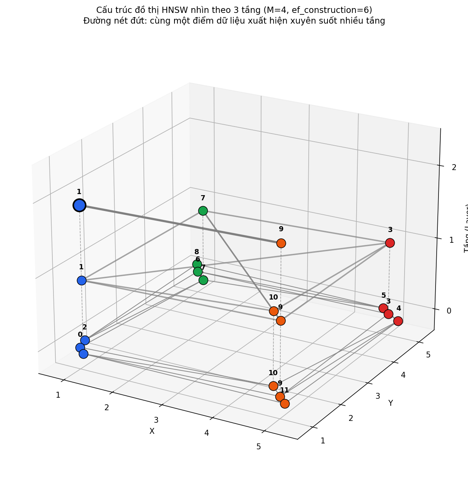
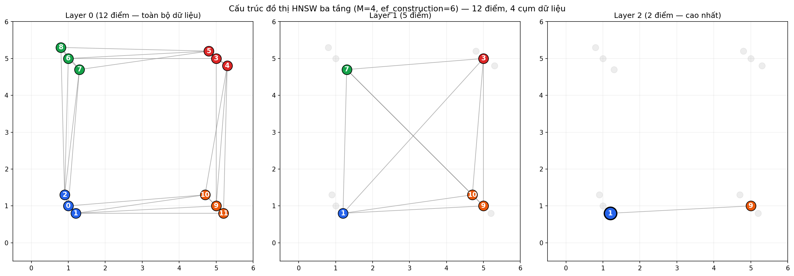

# PHẦN I — ANN LÀ GÌ

## 1. Bài toán gốc và định nghĩa

Bài toán gốc mà cả k-NN (k-Nearest Neighbors) và ANN cùng hướng tới giải quyết là: cho một tập hợp N điểm dữ liệu trong không gian nhiều chiều, và một điểm truy vấn bất kỳ, tìm ra k điểm gần nhất với điểm truy vấn đó, dựa trên một phép đo khoảng cách hoặc độ tương đồng cho trước.

Có hai chiến lược để giải bài toán này. **Brute-force**, hay tìm kiếm chính xác tuyệt đối, tính khoảng cách từ điểm truy vấn tới toàn bộ N điểm trong tập dữ liệu, sắp xếp, rồi lấy ra k điểm gần nhất. Cách này luôn đảm bảo kết quả đúng tuyệt đối theo đúng định nghĩa toán học của khoảng cách, nhưng chi phí tính toán là $O(N \times d)$ cho mỗi lượt truy vấn, với $d$ là số chiều của vector — chi phí này tăng tuyến tính theo cả số lượng dữ liệu lẫn số chiều.

**ANN (Approximate Nearest Neighbor)**, hay tìm kiếm gần đúng, là họ các chiến lược khác để giải cùng bài toán k-NN, nhưng chấp nhận đánh đổi một phần độ chính xác tuyệt đối để đổi lấy tốc độ truy vấn nhanh hơn đáng kể, thông qua các cấu trúc dữ liệu chuyên biệt được xây dựng sẵn (index) thay vì vét cạn toàn bộ dữ liệu mỗi lần truy vấn.

## 2. Vì sao cần đến ANN — không đơn thuần là bài toán hiệu năng

Ở quy mô dữ liệu lớn và số chiều cao — như vector 512 chiều do CLIP sinh ra — brute-force trở nên tốn kém về mặt tính toán. Nhưng lý do sâu xa hơn để chuyển sang ANN không đơn thuần là đánh đổi tốc độ lấy chi phí.

Trong không gian nhiều chiều, một hiện tượng hình học gọi là curse of dimensionality khiến ranh giới giữa **"kết quả gần nhất chính xác tuyệt đối"** và **"kết quả gần đúng"** tự nhiên bị nhòe đi — khoảng cách giữa các điểm trong không gian cao chiều có xu hướng trở nên gần như đồng đều với nhau. Điều này có nghĩa phần độ chính xác tưởng như bị hy sinh khi chuyển từ brute-force sang ANN thực chất đã không còn nhiều giá trị phân biệt thực tế ngay từ trong chính cấu trúc không gian dữ liệu. Chứng minh đầy đủ bằng công thức và thực nghiệm cho hiện tượng này sẽ được trình bày ở Phần IV, sau khi đã có đủ nền tảng về HNSW để liên hệ trực tiếp.

## 3. Bối cảnh — các nhánh chính của họ thuật toán ANN

Trước khi đi vào HNSW cụ thể, cần biết nó không phải là chiến lược duy nhất trong họ ANN — có ba trường phái chính, mỗi trường phái dựa trên một nguyên lý tổ chức dữ liệu khác nhau.

**Tree-based (dựa trên cây), ví dụ KD-tree, Ball-tree.** Chia không gian dữ liệu thành các vùng bằng một cấu trúc cây nhị phân, mỗi lần chia dựa trên một chiều hoặc một siêu phẳng cụ thể. Hoạt động rất tốt ở không gian thấp chiều, nhưng suy biến mạnh khi số chiều tăng cao — chính vì curse of dimensionality khiến việc chia không gian theo từng chiều riêng lẻ dần mất đi ý nghĩa phân biệt.

**Hash-based (dựa trên băm), ví dụ LSH — Locality Sensitive Hashing.** Sử dụng một hàm băm đặc biệt để các vector "gần nhau" trong không gian gốc có xu hướng rơi vào cùng một nhóm (bucket) sau khi băm. Khi truy vấn, chỉ cần so sánh trong đúng nhóm chứa điểm truy vấn, không cần so với toàn bộ dữ liệu. Tốc độ tìm kiếm nhanh, nhưng recall (tỉ lệ tìm đúng kết quả) thường không cao bằng các phương pháp dựa trên đồ thị.

**Graph-based (dựa trên đồ thị), ví dụ HNSW, NSG.** Xây dựng một đồ thị trong đó mỗi vector là một đỉnh, các đỉnh "gần nhau" về mặt khoảng cách được nối với nhau bằng cạnh. Việc tìm kiếm được thực hiện bằng cách duyệt qua đồ thị, di chuyển dần về phía điểm truy vấn. Đây là trường phái cho recall cao nhất ở một chi phí hợp lý trên dữ liệu nhiều chiều, và là trường phái mà HNSW — thuật toán được sử dụng trong hệ thống, thông qua pgvector — thuộc về.

## 4. Định vị HNSW trong bức tranh Machine Learning rộng hơn

Đây là điểm cần phân biệt rõ ràng, đặc biệt khi so sánh với CLIP đã trình bày ở phần trước: **HNSW không phải một mô hình học có tham số được huấn luyện qua gradient descent**. Nó là một **cấu trúc dữ liệu (data structure) kết hợp một thuật toán duyệt (traversal algorithm)**, được xây dựng dựa trên chính các vector đã có sẵn — không có khái niệm "huấn luyện" theo nghĩa tối ưu hóa hàm mất mát, không có trọng số nào được học qua backpropagation.

Điều này khác biệt căn bản so với CLIP, nơi các tham số của mạng neural được học từ dữ liệu qua một quá trình tối ưu hóa liên tục. Với HNSW, "xây dựng" (build/insert) đồ thị là một quy trình thuật toán tất định (deterministic theo nghĩa logic, dù có yếu tố ngẫu nhiên trong việc gán tầng, xem Phần III), không phải một quá trình học từ dữ liệu theo nghĩa thống kê.

Tuy vậy, HNSW vẫn có liên hệ chặt chẽ với khái niệm metric learning đã trình bày ở Phần I của CLIP: nó là thành phần hạ tầng khai thác trực tiếp không gian metric mà CLIP đã học được — nếu CLIP là bên tạo ra một không gian vector có ý nghĩa (nơi khoảng cách phản ánh đúng độ liên quan ngữ nghĩa), thì HNSW là bên khai thác chính không gian đó một cách hiệu quả, để tìm kiếm nhanh mà không cần duyệt toàn bộ dữ liệu. Hai thành phần này đóng hai vai trò bổ sung nhau: một bên tạo ra "bản đồ" ngữ nghĩa có ý nghĩa, một bên tạo ra "con đường tắt" để di chuyển nhanh trên chính bản đồ đó.

---

# PHẦN II — NGUYÊN LÝ HOẠT ĐỘNG VÀ CẤU TẠO CỦA HNSW

## 1. Từ Navigable Small World tới Hierarchical

### Ý tưởng gốc — đồ thị đơn tầng

Xây dựng một đồ thị: mỗi điểm dữ liệu là một đỉnh, mỗi đỉnh được nối với một số ít "hàng xóm gần" của nó — không nối với toàn bộ các đỉnh khác, vì làm vậy sẽ quay lại đúng chi phí $O(N)$ của brute-force. Cấu trúc này lấy cảm hứng từ hiện tượng "sáu độ tách biệt" trong mạng xã hội: dù mạng lưới có hàng tỷ người, chỉ cần trung bình sáu bước quen biết là có thể nối được hai người bất kỳ, nhờ sự tồn tại của một số ít "người kết nối rộng" (hub) trong mạng lưới.

**Tìm kiếm bằng greedy search**: bắt đầu từ một điểm bất kỳ trong đồ thị (entry point), nhìn vào các hàng xóm của điểm hiện tại, di chuyển tới hàng xóm nào gần điểm truy vấn nhất, lặp lại quá trình này cho tới khi không còn hàng xóm nào gần hơn điểm hiện tại nữa — điểm dừng lại chính là kết quả tìm kiếm.

**Vấn đề của đồ thị đơn tầng**: ở giai đoạn đầu tìm kiếm, khi vị trí hiện tại còn cách xa điểm truy vấn, mỗi bước di chuyển chỉ nhích được một khoảng cách nhỏ, vì các hàng xóm đều là những điểm "gần nhau cục bộ". Cần rất nhiều bước mới có thể đi từ một đầu của đồ thị sang đầu kia — đây chính là chỗ ý tưởng phân tầng ra đời để giải quyết.

### Thêm chữ Hierarchical — đồ thị nhiều tầng

Xây dựng nhiều tầng đồ thị chồng lên nhau. Tầng cao nhất rất thưa, chỉ chứa một số ít điểm được chọn ngẫu nhiên, với các kết nối mang tính "nhảy xa". Càng xuống các tầng dưới, mật độ điểm càng dày đặc hơn, kết nối càng cục bộ hơn, cho tới tầng thấp nhất — gọi là Layer 0 — chứa toàn bộ N điểm dữ liệu.

**Cơ chế tìm kiếm đi từ trên xuống dưới**: bắt đầu ở tầng cao nhất, tại đúng entry point cố định. Thực hiện greedy search trong tầng đó — nhờ các kết nối nhảy xa, nhanh chóng tiếp cận được vùng lân cận đại khái gần với điểm truy vấn. Khi không tiến được nữa ở tầng hiện tại, hạ xuống tầng thấp hơn liền kề, tại đúng điểm vừa dừng lại, tiếp tục quá trình tìm kiếm trong phạm vi hẹp hơn và chính xác hơn. Lặp lại việc hạ tầng cho tới khi chạm Layer 0.

**Đây là điểm mấu chốt về cơ chế tìm kiếm, cần phân biệt rõ**: tại mọi tầng phía trên Layer 0, thuật toán dùng đúng **greedy search thuần túy** — tại mỗi bước chỉ giữ lại đúng một ứng viên tốt nhất, di chuyển dứt khoát theo hướng đó, tương đương với việc đặt độ rộng tìm kiếm bằng 1. Chỉ riêng tại **Layer 0**, tầng cuối cùng và duy nhất chứa toàn bộ dữ liệu, thuật toán mới chuyển sang một biến thể gọi là **beam search**: giữ lại một danh sách gồm nhiều ứng viên tốt nhất cùng lúc (kích thước danh sách này chính là tham số ef_search), mở rộng tìm kiếm song song từ toàn bộ danh sách đó trước khi chốt kết quả cuối cùng.

Lý do phân biệt hai cơ chế này: greedy search thuần túy có nhược điểm cố hữu là dễ mắc kẹt ở một cực tiểu địa phương — một điểm mà mọi hàng xóm xung quanh đều "kém hơn" theo phép đo cục bộ, dù trên thực tế vẫn còn một hướng đi khác dẫn tới kết quả tốt hơn. Rủi ro này tồn tại nhiều nhất ở các tầng trên, nhưng được giảm nhẹ tự nhiên nhờ chính đặc điểm cấu trúc của các tầng đó — chúng rất thưa, kết nối mang tính nhảy xa, nên xác suất tồn tại một cực tiểu địa phương gây lạc hướng nghiêm trọng thấp hơn nhiều so với một đồ thị dày đặc. Tại Layer 0, nơi mật độ dày đặc và dễ gặp cực tiểu địa phương hơn, HNSW mới cần tới beam search để bù đắp đúng rủi ro này.

### Ẩn dụ trực quan — hành trình từ trạm không gian về đến nhà

Tưởng tượng một hành trình về nhà tại Thành phố Hồ Chí Minh, xuất phát từ Hà Nội. Trước khi có cấu trúc phân tầng, chỉ có thể di chuyển bằng đường bộ — phải đi qua tuần tự từng tỉnh thành, tương đương với việc chỉ có "chiều ngang", không có "chiều cao" để di chuyển.

Với cấu trúc phân tầng, xuất hiện các trạm dịch chuyển. Bước đầu tiên là lên tới quỹ đạo cao của khí quyển — đây chính là entry point, điểm khởi đầu của HNSW. Tại đó, nhìn vào bản đồ toàn cầu và chọn điểm đến là Thành phố Hồ Chí Minh — tương đương với việc đưa vào một câu truy vấn. Từ trạm này, di chuyển xuống các trạm trung chuyển thấp hơn: một trạm dẫn về các tỉnh thành trong nội bộ Việt Nam, một trạm khác dẫn sang Trung Quốc, một trạm khác nữa dẫn sang Úc — và có thể còn những trạm cao hơn nữa dẫn tới các châu lục khác. Cứ thế hạ dần từ tầng khí quyển cao xuống các tầng thấp hơn, cho tới khi bãi đáp cuối cùng dừng ngay tại Thành phố Hồ Chí Minh. Bãi đáp này chính là hình ảnh của "một điểm dữ liệu vừa nằm ở tầng cao vừa nằm ở tầng thấp" — đóng vai trò một hub điều hướng. Sau đó, bắt một chuyến xe buýt để về đúng nhà — mỗi lần xe dừng lại tương đương với việc hạ xuống một tầng thấp hơn, cho tới khi về đến chính xác căn nhà, tương đương với kết quả cuối cùng tại Layer 0.

**Lưu ý quan trọng về bản chất của việc "được chọn lên tầng cao"**: khác với ẩn dụ phân cấp địa lý có chủ đích trong ví dụ trên (nơi thủ đô một quốc gia hiển nhiên là một trạm quan trọng), trong HNSW thật, việc một điểm dữ liệu được "thăng hạng" lên tầng cao hơn là **hoàn toàn ngẫu nhiên** — không dựa trên bất kỳ ý nghĩa ngữ nghĩa hay tầm quan trọng nào của chính điểm đó. Một điểm dữ liệu chỉ xuất hiện duy nhất ở Layer 0 không hề "kém quan trọng về ngữ nghĩa" so với một điểm xuất hiện xuyên suốt nhiều tầng — nó chỉ đơn giản là không được chọn ngẫu nhiên để đóng vai trò dẫn đường. Mọi tầng, dù cao hay thấp, đều chứa cùng một loại thông tin — vector đầy đủ số chiều như nhau — chỉ khác nhau về **số lượng điểm hiện diện**, không khác nhau về **chất lượng hay độ sâu thông tin** của từng điểm.

## 2. Ba tham số cấu hình — M, ef_construction, ef_search

| Tham số | Định nghĩa | Giai đoạn ảnh hưởng | Đánh đổi khi tăng |
|---|---|---|---|
| **M** | Số cạnh tối đa mỗi điểm được giữ, ở mỗi tầng | Cấu trúc đồ thị, cố định sau khi build | Recall tăng, bộ nhớ tăng, build chậm hơn |
| **ef_construction** | Kích thước danh sách ứng viên tạm thời khi tìm hàng xóm lúc build | Chỉ một lần, lúc xây index (hoặc mỗi lần chèn thêm điểm mới) | Chất lượng đồ thị tăng, build chậm hơn, không ảnh hưởng tốc độ query |
| **ef_search** | Kích thước danh sách ứng viên tạm thời khi tìm kiếm lúc query, chỉ áp dụng tại Layer 0 | Mỗi lần truy vấn | Recall tăng, độ trễ mỗi query tăng |

**Ẩn dụ tương ứng với ba tham số**: M là số tuyến đường mỗi trạm được phép mở ra. ef_construction là mức độ khảo sát kỹ lưỡng khi quy hoạch một trạm mới, trước khi quyết định nối tuyến nào trong số M tuyến cho phép. ef_search là số lượng con hẻm lân cận được "dạo qua" trước khi chốt đâu là căn nhà đúng nhất, khi đã hạ cánh gần khu vực đích — và đúng với cơ chế thật, việc "dạo nhiều hẻm" này chỉ xảy ra ở chặng cuối cùng (Layer 0, đi bộ trong khu dân cư), còn toàn bộ hành trình từ trạm vũ trụ xuống các trạm trung chuyển phía trên vẫn là đi thẳng một đường duy nhất mỗi lần (greedy thuần túy).

## 3. Độ phức tạp tìm kiếm — vì sao gần với O(log N)

Cơ chế **"đi xa nhanh bằng greedy thuần túy ở các tầng trên"** sau đó **"tìm kiếm rộng và chính xác bằng beam search ở Layer 0"** giúp tổng số bước duyệt giảm mạnh so với brute-force. Trực giác: mỗi tầng giúp thu hẹp phạm vi tìm kiếm theo cấp số nhân, tương tự cơ chế binary search nhưng áp dụng trên cấu trúc đồ thị thay vì trên một mảng đã sắp xếp.

Số tầng cần thiết để "phủ" đủ N điểm dữ liệu có quan hệ tỉ lệ với $\log N$: khi xây dựng, mỗi điểm được gán ngẫu nhiên một tầng cao nhất mà nó xuất hiện, theo một phân phối xác suất giảm dần theo cấp số nhân — xác suất một điểm xuất hiện ở tầng $l$ tỉ lệ với $\left(\frac{1}{2}\right)^l$. Vì mật độ giảm theo cấp số nhân này, số tầng cần thiết để đảm bảo tầng cao nhất vẫn đủ thưa (giữ tốc độ nhảy nhanh) mà tầng thấp nhất vẫn chứa đủ toàn bộ N điểm chính là $O(\log N)$ — đây là lý do độ phức tạp tìm kiếm lý thuyết của HNSW đạt gần $O(\log N)$, so với $O(N)$ của brute-force.

---

## 4. Mã giả và triển khai thực tế

### Mã giả cho quy trình chèn một điểm dữ liệu mới (insert)

```
HÀM chèn_điểm(đồ_thị, điểm_mới, M, ef_construction):
    tầng_của_điểm_mới ← chọn_ngẫu_nhiên_theo_phân_phối_mũ()
    
    NẾU đồ_thị rỗng:
        thêm điểm_mới vào đồ_thị, đánh dấu là entry_point
        TRẢ VỀ

    vị_trí_hiện_tại ← entry_point
    tầng_hiện_tại ← tầng_cao_nhất_của_đồ_thị

    # Giai đoạn 1: greedy thuần túy, đi từ tầng cao nhất xuống
    # tới tầng ngay trên tầng của điểm mới
    LẶP tầng_hiện_tại TỪ tầng_cao_nhất XUỐNG (tầng_của_điểm_mới + 1):
        vị_trí_hiện_tại ← greedy_search_một_tầng(vị_trí_hiện_tại, điểm_mới, tầng_hiện_tại)

    # Giai đoạn 2: từ tầng của điểm mới xuống tới Layer 0,
    # dùng beam_search với ef_construction để tìm ứng viên hàng xóm
    LẶP tầng_hiện_tại TỪ tầng_của_điểm_mới XUỐNG 0:
        ứng_viên ← beam_search_một_tầng(vị_trí_hiện_tại, điểm_mới, tầng_hiện_tại, ef_construction)
        hàng_xóm_được_chọn ← chọn_M_ứng_viên_tốt_nhất(ứng_viên, M)
        nối_cạnh(điểm_mới, hàng_xóm_được_chọn, tầng_hiện_tại)
        vị_trí_hiện_tại ← ứng_viên_tốt_nhất(ứng_viên)

    NẾU tầng_của_điểm_mới > tầng_cao_nhất_hiện_tại:
        entry_point ← điểm_mới
```

### Mã giả cho quy trình tìm kiếm (search)

```
HÀM tìm_kiếm(đồ_thị, điểm_truy_vấn, k, ef_search):
    vị_trí_hiện_tại ← entry_point
    tầng_hiện_tại ← tầng_cao_nhất_của_đồ_thị

    # Greedy thuần túy ở mọi tầng phía trên Layer 0
    LẶP tầng_hiện_tại TỪ tầng_cao_nhất XUỐNG 1:
        vị_trí_hiện_tại ← greedy_search_một_tầng(vị_trí_hiện_tại, điểm_truy_vấn, tầng_hiện_tại)

    # Beam search chỉ tại Layer 0
    ứng_viên ← beam_search_một_tầng(vị_trí_hiện_tại, điểm_truy_vấn, tầng=0, ef_search)
    TRẢ VỀ k_ứng_viên_tốt_nhất(ứng_viên, k)
```

### Cài đặt Python đầy đủ

```python
import random
import math
from typing import List, Tuple, Dict, Set
import heapq

class HNSW:
    def __init__(self, M: int = 16, ef_construction: int = 200, distance_func=None):
        self.M = M
        self.ef_construction = ef_construction
        self.m_L = 1.0 / math.log(M)  # hệ số chuẩn hóa cho phân phối tầng
        self.distance_func = distance_func or self._euclidean_distance

        self.vectors: Dict[int, List[float]] = {}
        self.layers: Dict[int, Dict[int, Set[int]]] = {}  # tầng -> {đỉnh: {hàng xóm}}
        self.entry_point: int = None
        self.max_layer: int = -1
        self.node_layer: Dict[int, int] = {}  # đỉnh -> tầng cao nhất của nó

    @staticmethod
    def _euclidean_distance(a: List[float], b: List[float]) -> float:
        return math.sqrt(sum((x - y) ** 2 for x, y in zip(a, b)))

    def _random_layer(self) -> int:
        # Phân phối mũ: xác suất giảm dần theo cấp số nhân khi tầng tăng
        return int(-math.log(random.random()) * self.m_L)

    def _greedy_search_layer(self, entry: int, query: List[float], layer: int) -> int:
        """Greedy search thuần túy: chỉ giữ đúng 1 ứng viên tốt nhất mỗi bước."""
        current = entry
        current_dist = self.distance_func(self.vectors[current], query)

        improved = True
        while improved:
            improved = False
            for neighbor in self.layers[layer].get(current, set()):
                d = self.distance_func(self.vectors[neighbor], query)
                if d < current_dist:
                    current = neighbor
                    current_dist = d
                    improved = True
        return current

    def _beam_search_layer(self, entry: int, query: List[float], layer: int, ef: int) -> List[Tuple[float, int]]:
        """Beam search: giữ ef ứng viên tốt nhất song song."""
        visited = {entry}
        entry_dist = self.distance_func(self.vectors[entry], query)

        # Hàng đợi ứng viên cần khám phá (min-heap theo khoảng cách)
        candidates = [(entry_dist, entry)]
        heapq.heapify(candidates)

        # Kết quả tốt nhất tìm được (max-heap để dễ loại bỏ ứng viên tệ nhất)
        best_found = [(-entry_dist, entry)]
        heapq.heapify(best_found)

        while candidates:
            current_dist, current = heapq.heappop(candidates)

            # Nếu ứng viên hiện tại đã tệ hơn ứng viên tệ nhất trong kết quả,
            # và kết quả đã đủ ef phần tử, dừng lại
            if len(best_found) >= ef and current_dist > -best_found[0][0]:
                break

            for neighbor in self.layers[layer].get(current, set()):
                if neighbor not in visited:
                    visited.add(neighbor)
                    d = self.distance_func(self.vectors[neighbor], query)

                    if len(best_found) < ef or d < -best_found[0][0]:
                        heapq.heappush(candidates, (d, neighbor))
                        heapq.heappush(best_found, (-d, neighbor))
                        if len(best_found) > ef:
                            heapq.heappop(best_found)

        return sorted([(-d, node) for d, node in best_found])

    def insert(self, node_id: int, vector: List[float]) -> None:
        self.vectors[node_id] = vector
        node_layer = self._random_layer()
        self.node_layer[node_id] = node_layer

        for l in range(node_layer + 1):
            if l not in self.layers:
                self.layers[l] = {}
            self.layers[l][node_id] = set()

        if self.entry_point is None:
            self.entry_point = node_id
            self.max_layer = node_layer
            return

        current = self.entry_point

        # Giai đoạn 1: greedy thuần túy từ tầng cao nhất xuống tầng ngay trên node_layer
        for l in range(self.max_layer, node_layer, -1):
            current = self._greedy_search_layer(current, vector, l)

        # Giai đoạn 2: beam search với ef_construction, từ node_layer xuống 0
        for l in range(min(node_layer, self.max_layer), -1, -1):
            candidates = self._beam_search_layer(current, vector, l, self.ef_construction)
            neighbors = [node for _, node in candidates[:self.M]]

            for neighbor in neighbors:
                self.layers[l][node_id].add(neighbor)
                self.layers[l][neighbor].add(node_id)
                # Cắt bớt nếu hàng xóm vượt quá M kết nối (đơn giản hóa: giữ M gần nhất)
                if len(self.layers[l][neighbor]) > self.M:
                    dists = [(self.distance_func(self.vectors[n], self.vectors[neighbor]), n)
                             for n in self.layers[l][neighbor]]
                    dists.sort()
                    self.layers[l][neighbor] = {n for _, n in dists[:self.M]}

            if candidates:
                current = candidates[0][1]

        if node_layer > self.max_layer:
            self.max_layer = node_layer
            self.entry_point = node_id

    def search(self, query: List[float], k: int, ef_search: int = None) -> List[Tuple[float, int]]:
        if ef_search is None:
            ef_search = max(k, self.ef_construction)

        current = self.entry_point

        # Greedy thuần túy ở mọi tầng phía trên Layer 0
        for l in range(self.max_layer, 0, -1):
            current = self._greedy_search_layer(current, query, l)

        # Beam search chỉ tại Layer 0
        candidates = self._beam_search_layer(current, query, 0, ef_search)
        return candidates[:k]
```
## 5. Chạy tay từng bước — build đồ thị trên bộ dữ liệu nhỏ

Để thấy rõ cơ chế hoạt động, xây dựng đồ thị HNSW trên 12 điểm 2D, chia thành 4 cụm tách biệt rõ ràng ở bốn góc: cụm A (điểm 0, 1, 2) góc dưới-trái, cụm B (điểm 3, 4, 5) góc trên-phải, cụm C (điểm 6, 7, 8) góc trên-trái, cụm D (điểm 9, 10, 11) góc dưới-phải — với cấu hình M=4, ef_construction=6.

### Quan sát trong quá trình build

Khi chèn điểm 1, thuật toán ngẫu nhiên gán cho nó tầng cao nhất là 2 — cao hơn hẳn điểm 0 (chỉ ở tầng 0) — và vì đây là tầng cao nhất từng xuất hiện, điểm 1 trở thành entry_point mới. Đây chính là minh chứng cho tính ngẫu nhiên của việc gán tầng: không có gì đặc biệt về điểm 1 khiến nó "xứng đáng" làm hub, chỉ đơn thuần là may mắn trong phép gán ngẫu nhiên.

Khi chèn điểm 9 (thuộc cụm D, góc dưới-phải, cách xa điểm 1 ở cụm A), nó cũng ngẫu nhiên được gán tầng 2 — tầng cao nhất hiện tại. Quan sát log build cho thấy: tại tầng 2, thuật toán tìm ứng viên và nối điểm 9 với điểm 1 — hai điểm ở hai góc đối diện của mặt phẳng dữ liệu, cách xa nhau nhất trong toàn bộ tập, lại trở thành hai hub duy nhất ở tầng cao nhất, kết nối trực tiếp với nhau. Đây chính xác là vai trò "đường cao tốc" của tầng trên: một kết nối duy nhất nhưng bắc cầu được qua toàn bộ không gian dữ liệu.

Khi chèn điểm 8 (cụm C), quá trình greedy tại tầng 1 đi từ điểm 1 tới điểm 7 — di chuyển từ một hub tổng quát tới một hub gần đúng cụm C hơn — trước khi bước vào Layer 0 để tìm chính xác các hàng xóm gần nhất là điểm 6 và điểm 7, đúng hai điểm cùng cụm C.

### Cấu trúc đồ thị sau khi build xong

| Tầng | Số điểm hiện diện | Ý nghĩa |
|---|---|---|
| 2 | 2 điểm (1, 9) | Rất thưa — đúng vai trò "đường cao tốc liên cụm" |
| 1 | 5 điểm (1, 3, 7, 9, 10) | Trung gian — mỗi cụm có ít nhất một đại diện |
| 0 | 12 điểm (toàn bộ) | Đầy đủ — nơi trả về kết quả chính xác cuối cùng |





Quan sát này khớp đúng lý thuyết: số điểm giảm dần theo cấp số nhân khi lên tầng cao hơn (12 → 5 → 2), và ở tầng 1, hầu như mỗi cụm dữ liệu đều có ít nhất một đại diện (điểm 1 và điểm 10 gần cụm A/D, điểm 3 gần cụm B, điểm 7 gần cụm C) — dù đây không phải điều được thiết kế có chủ đích, mà là hệ quả tự nhiên của việc phân phối xác suất tầng cao là đồng đều trên toàn bộ dữ liệu.

## 6. Thí nghiệm tìm kiếm — quan sát trực tiếp đánh đổi giữa ef_search và độ chính xác

Thực hiện một truy vấn tại tọa độ $[1.1, 4.9]$ — nằm rất gần cụm C (điểm 6, 7, 8).

### Chạy tìm kiếm với ef_search khác nhau

Với **ef_search = 2**: quá trình greedy đi qua tầng 2 (giữ nguyên tại điểm 1, do điểm 1 đã là gần nhất trong các hàng xóm của chính nó ở tầng đó), rồi greedy tại tầng 1 di chuyển từ điểm 1 sang điểm 7 — đúng hướng về phía cụm C. Beam search tại Layer 0 với ef_search=2 chỉ khám phá được 2 ứng viên, trả về kết quả top-3 nhưng thực chất chỉ có 2 phần tử: điểm 6 và điểm 7 — **thiếu mất điểm 8**.

Với **ef_search = 8**: cùng đường đi greedy giống hệt, nhưng beam search tại Layer 0 mở rộng khám phá 8 ứng viên, trả về đầy đủ top-3: điểm 6, điểm 7, và điểm 8 — **khớp chính xác tuyệt đối với brute-force**.

Đây là minh chứng trực tiếp, chạy tay được, cho lý thuyết đã học: beam search hẹp (ef_search nhỏ) có nguy cơ dừng lại quá sớm, bỏ sót ứng viên đúng nằm ngay gần đó nhưng chưa kịp được khám phá.

### Thí nghiệm mở rộng — đo Recall@3 trên 20 truy vấn ngẫu nhiên

| ef_search | Recall@3 | Số kết quả đúng / tổng |
|---|---|---|
| 1 | 0.333 | 20/60 |
| 2 | 0.667 | 40/60 |
| 4 | 1.000 | 60/60 |
| 8 | 1.000 | 60/60 |
| 12 | 1.000 | 60/60 |

Kết quả này minh họa rõ nét đúng hai điều đã học ở phần lý thuyết trước:

**Thứ nhất, quan hệ giữa ef_search và Recall là đơn điệu tăng nhưng có điểm bão hòa.** Từ ef_search=1 đến ef_search=4, Recall tăng đều đặn từ 0.333 lên 1.000 — mỗi lần mở rộng độ rộng tìm kiếm, mô hình giảm được rủi ro bỏ sót kết quả đúng do dừng lại quá sớm. Nhưng từ ef_search=4 trở đi, Recall đã đạt trần tuyệt đối và không thể tăng thêm — tăng ef_search vượt quá mức cần thiết chỉ tốn thêm chi phí tính toán mà không mang lại lợi ích gì, đúng như hiện tượng lợi ích giảm dần (diminishing returns) đã phân tích ở phần lý thuyết.

**Thứ hai, với bộ dữ liệu nhỏ và có cấu trúc cụm rõ ràng như thí nghiệm này, chỉ cần ef_search rất nhỏ (bằng 4, trong khi tổng dữ liệu có 12 điểm) đã đạt Recall tuyệt đối** — đây chính là minh chứng thực nghiệm cho luận điểm đã học: dữ liệu có cấu trúc cụm ngữ nghĩa rõ ràng (như vector CLIP sinh ra, nhờ quá trình học tương phản) giúp HNSW đạt hiệu năng cao với chi phí tìm kiếm thấp — khác hẳn với dữ liệu ngẫu nhiên không có cấu trúc, nơi cần ef_search lớn hơn nhiều mới đạt được cùng mức Recall.

---

# PHẦN III — XÂY DỰNG LẠI HNSW TỪ CON SỐ 0 BẰNG LẬP LUẬN

## Mở đầu: đặt lại đúng bài toán cần giải

Trước khi lắp ráp bất kỳ thành phần nào, cần xác định rõ bài toán: cho N vector đã biết trước (ví dụ N ảnh đã được CLIP mã hóa), và một vector truy vấn mới, cần tìm ra k vector gần nhất với truy vấn đó, với chi phí tính toán thấp hơn hẳn việc so sánh với toàn bộ N vector mỗi lần truy vấn. Toàn bộ những gì trình bày dưới đây là chuỗi quyết định cần thiết, từng bước một, để đi từ phát biểu bài toán này tới đúng cấu trúc HNSW đã thấy ở Phần II.

---

## Quyết định 1 — Cần một cấu trúc chỉ mục thay vì vét cạn

**Vấn đề:** cách đơn giản nhất để giải bài toán trên là brute-force — tính khoảng cách từ truy vấn tới toàn bộ N vector, sắp xếp, lấy k kết quả gần nhất. Cách này đúng tuyệt đối, nhưng chi phí $O(N)$ mỗi lần truy vấn trở nên không chấp nhận được khi N lên tới hàng trăm nghìn hay hàng triệu.

**Lời giải:** thay vì tính toán lại từ đầu mỗi lần truy vấn, xây dựng trước một cấu trúc dữ liệu phụ trợ — gọi là chỉ mục (index) — một lần duy nhất, tổ chức sẵn N vector theo một cách nào đó giúp việc tìm kiếm sau này nhanh hơn nhiều so với vét cạn. Đây là nguyên lý chung của mọi hệ thống chỉ mục, không riêng gì HNSW: đánh đổi chi phí xây dựng ban đầu (trả một lần) để lấy chi phí truy vấn thấp hơn (trả nhiều lần, mỗi lần có lợi).

**Câu hỏi kế tiếp cần trả lời:** cấu trúc chỉ mục đó nên có hình dạng gì?

---

## Quyết định 2 — Vì sao không dùng cấu trúc cây truyền thống

**Vấn đề:** các cấu trúc chỉ mục kinh điển trong khoa học máy tính, như B-tree hay KD-tree, đã tồn tại từ lâu và chứng minh hiệu quả cho nhiều bài toán tìm kiếm. Câu hỏi tự nhiên: tại sao không dùng thẳng chúng cho bài toán vector?

**Lời giải — cần phân tích đúng bản chất toán học mà B-tree dựa vào.** B-tree hoạt động dựa trên khái niệm thứ tự tuyến tính (total order): với hai giá trị bất kỳ, luôn xác định được chính xác giá trị nào lớn hơn, nhỏ hơn, hoặc bằng nhau, dựa trên một đại lượng vô hướng duy nhất — độ lớn (magnitude). Đây là điều kiện tiên quyết để B-tree có thể sắp xếp toàn bộ dữ liệu theo đúng một tiêu chí cố định.

Nhưng bài toán tìm kiếm vector không cần đo *độ lớn*, mà cần đo *hướng* — cụ thể là độ tương đồng cosine, chính là công thức đã xây ở **Quyết định 2** của Phần III (Tài liệu CLIP):

$$\text{sim}(I, T) = \hat{I} \cdot \hat{T} = \cos(\theta)$$

Công thức này chủ động chia cho độ lớn của cả 2 vector (thông qua bước chuẩn hóa L2) để triệt tiêu hoàn toàn ảnh hưởng của độ lớn, chỉ giữ lại thông tin về góc. B-tree đo và sắp xếp dựa trên chính đại lượng độ lớn mà cosine similarity đã chủ động loại bỏ — hai cấu trúc này đang vận hành trên hai đại lượng toán học khác nhau của cùng một vector. Không có cách nào tự nhiên để nói "vector A nhỏ hơn vector B" theo nghĩa tuyến tính tổng quát cho mọi cặp vector 512 chiều, vì mỗi chiều có thể "lớn hơn" theo hướng khác nhau.

**Kết luận của Quyết định 2:** cần một cấu trúc chỉ mục không dựa trên thứ tự tuyến tính, mà dựa trên khái niệm *độ gần* (proximity) — quan hệ cục bộ giữa các điểm lân cận nhau trong không gian, không cần sắp xếp toàn cục theo một tiêu chí duy nhất. Cấu trúc tự nhiên nhất thỏa mãn yêu cầu này là đồ thị (graph): mỗi điểm là một đỉnh, các điểm gần nhau được nối bằng cạnh, không cần bất kỳ khái niệm thứ tự toàn cục nào.

---

## Quyết định 3 — Vì sao một đồ thị đơn tầng chưa đủ

**Vấn đề:** xây một đồ thị theo Quyết định 2 — mỗi điểm nối với vài điểm gần nó nhất. Tìm kiếm bằng cách xuất phát từ một điểm bất kỳ, luôn di chuyển tới hàng xóm gần truy vấn hơn, dừng lại khi không còn hàng xóm nào gần hơn (greedy search).

Vấn đề nằm ở tốc độ hội tụ. Trong một đồ thị đơn tầng, mỗi cạnh chỉ nối các điểm *gần nhau cục bộ* — nếu điểm truy vấn nằm cách xa điểm xuất phát, cần rất nhiều bước di chuyển liên tiếp mới tới nơi, vì mỗi bước chỉ nhích được một khoảng ngắn.

**Chứng minh bằng ước lượng số bước:** giả sử N điểm được rải đều trong không gian, mỗi điểm nối trung bình với $M$ hàng xóm gần nhất của nó. Với một đồ thị đơn tầng thuần túy dạng lưới cục bộ như vậy, số bước cần thiết để đi từ một điểm bất kỳ tới điểm đích tỉ lệ với căn bậc của N (tương tự việc di chuyển trên một lưới ô vuông $\sqrt{N} \times \sqrt{N}$, cần khoảng $\sqrt{N}$ bước để đi từ góc này sang góc kia) — tốt hơn $O(N)$ của brute-force, nhưng vẫn còn xa mới đạt tới $O(\log N)$ mong muốn.

**Lời giải:** bổ sung thêm các cạnh "nhảy xa" — không chỉ nối các hàng xóm gần cục bộ, mà còn có một số ít cạnh đặc biệt nối những điểm cách xa nhau, đóng vai trò như đường tắt. Nhưng nếu random thêm cạnh nhảy xa trực tiếp vào cùng một đồ thị, sẽ phá vỡ tính chất "hàng xóm gần cục bộ" cần thiết cho bước tinh chỉnh cuối cùng khi đã tới gần đích.

**Giải pháp triệt để hơn: tách hẳn thành nhiều tầng riêng biệt.** Tầng trên chỉ chứa một tập con thưa của toàn bộ điểm, với các cạnh có xu hướng dài hơn tự nhiên (vì ít điểm hơn trong cùng một không gian, khoảng cách trung bình giữa các hàng xóm gần nhất cũng lớn hơn). Tầng dưới chứa nhiều điểm hơn, cạnh ngắn hơn, cho tới tầng đáy chứa toàn bộ N điểm với cạnh hoàn toàn cục bộ. Tìm kiếm bắt đầu ở tầng thưa nhất để "nhảy nhanh" qua khoảng cách lớn, rồi hạ dần xuống các tầng dày đặc hơn để tinh chỉnh.

**Chứng minh bằng số bước duyệt giảm theo cấp số nhân:** nếu mỗi tầng có mật độ điểm giảm đi một nửa so với tầng ngay dưới nó (dẫn tới cần khoảng $\log_2 N$ tầng để từ N điểm giảm dần về 1 điểm ở tầng cao nhất), và tại mỗi tầng chỉ cần một số bước giới hạn (không phụ thuộc N) để tới đúng vùng cần tới nhờ các cạnh đã đủ dài ở tầng đó, thì tổng số bước duyệt qua toàn bộ hành trình từ tầng cao nhất xuống Layer 0 tỉ lệ với số tầng, tức $O(\log N)$ — đây chính là độ phức tạp mong muốn.

---

## Quyết định 4 — Vì sao cần ngẫu nhiên hóa việc gán tầng

**Vấn đề:** **Quyết định 3** đòi hỏi mỗi điểm được gán vào một hoặc nhiều tầng, với mật độ giảm dần khi lên cao. Câu hỏi: nên gán tầng cho từng điểm theo cách nào?

**Hướng A — thiết kế thủ công:** chọn trước một số điểm "quan trọng" làm hub, cố định đưa chúng lên tầng cao. Vấn đề của hướng này: cần một tiêu chí để xác định "điểm nào quan trọng" — nhưng bản thân dữ liệu vector không tự mang sẵn một tiêu chí quan trọng nào một cách khách quan trước khi biết trước toàn bộ tập truy vấn sẽ được hỏi trong tương lai. Thiết kế thủ công cũng không mở rộng được khi có điểm dữ liệu mới liên tục được thêm vào theo thời gian.

**Hướng B — ngẫu nhiên hóa theo một phân phối xác suất giảm dần, đây là hướng HNSW chọn:** mỗi điểm khi được thêm vào, tự động được gán một tầng cao nhất theo phân phối xác suất:

$$P(\text{tầng} = l) \propto \left(\frac{1}{M}\right)^l$$

với $M$ chính là tham số đã học ở Phần II. Xác suất giảm theo cấp số nhân khi $l$ tăng, đảm bảo đúng yêu cầu "mật độ giảm dần khi lên tầng cao hơn" của Quyết định 3, mà không cần bất kỳ tiêu chí thủ công nào.

**Ưu điểm của việc ngẫu nhiên hóa:**

1. **Không cần biết trước tập truy vấn tương lai** — vì việc gán tầng không dựa vào bất kỳ đặc điểm ngữ nghĩa nào của chính điểm dữ liệu, cấu trúc hoạt động tốt trung bình cho mọi phân phối truy vấn có thể xảy ra sau này, không thiên vị theo một giả định cụ thể nào.
2. **Tính chất thống kê đảm bảo hiệu năng trung bình ổn định** — dù từng lần build cụ thể có thể cho ra một cấu trúc hơi khác nhau (do tính ngẫu nhiên), về mặt kỳ vọng thống kê, số lượng điểm ở mỗi tầng luôn tuân theo đúng tỉ lệ mong muốn, đảm bảo độ phức tạp $O(\log N)$ giữ đúng trên trung bình nhiều lần build khác nhau, không phụ thuộc vào một cấu hình may rủi cụ thể.
3. **Dễ dàng mở rộng khi thêm dữ liệu mới** — mỗi điểm mới chỉ cần tự sinh ngẫu nhiên tầng của nó theo đúng công thức trên, không cần tính toán lại hay tổ chức lại toàn bộ cấu trúc đã có.

**Nhược điểm cần thừa nhận:** vì hoàn toàn ngẫu nhiên, có một xác suất nhỏ nhưng khác không rằng một điểm dữ liệu quan trọng về mặt ngữ nghĩa (ví dụ nằm ở trung tâm một cụm lớn) lại chỉ được gán vào Layer 0, không đóng vai trò hub nào — nhưng như đã phân tích ở Phần II, điều này không ảnh hưởng tới việc điểm đó có được *tìm thấy* hay không, chỉ ảnh hưởng tới tốc độ tìm ra nó.

---

## Tổng hợp: ráp bốn quyết định thành cấu trúc HNSW hoàn chỉnh

Ghép **Quyết định 1** (cần một chỉ mục xây trước, đánh đổi chi phí build lấy tốc độ truy vấn), **Quyết định 2** (chỉ mục phải dựa trên đồ thị biểu diễn quan hệ gần-xa cục bộ, không dựa trên thứ tự tuyến tính như B-tree), **Quyết định 3** (đồ thị đơn tầng chưa đủ nhanh, cần phân nhiều tầng với mật độ giảm dần để đạt $O(\log N)$), và **Quyết định 4** (việc gán tầng cần ngẫu nhiên hóa theo phân phối xác suất giảm dần, không thiết kế thủ công), ta thu được chính xác cấu trúc Hierarchical Navigable Small World đã mô tả chi tiết ở Phần II — cùng với đúng 3 tham số _M, ef_construction, ef_search_, mỗi tham số đều là câu trả lời trực tiếp cho một trong bốn quyết định trên: _M_ quyết định độ dày kết nối của đồ thị (Quyết định 2 và 3), _ef_construction_ quyết định độ kỹ lưỡng khi tìm hàng xóm lúc xây dựng từng tầng (Quyết định 3), còn _ef_search_ quyết định độ rộng tìm kiếm tại Layer 0 để chống lại nhược điểm cố hữu của greedy search đã nêu ở Phần II.

---

# PHẦN IV — HỆ QUẢ TOÁN HỌC TẤT YẾU (HIỆU ỨNG PHỤ)

## 1. Curse of Dimensionality — cầu nối từ CLIP sang lý do tồn tại của HNSW

Hiện tượng **curse of dimensionality** — khoảng cách giữa các điểm trong không gian nhiều chiều có xu hướng trở nên gần như đồng đều, làm mờ đi ranh giới giữa "gần" và "xa" — đã được chứng minh đầy đủ bằng công thức và thực nghiệm ở Phần IV của Tài liệu CLIP, thông qua đại lượng **Relative Contrast** và **Luật số lớn**. Không cần lặp lại toàn bộ chứng minh đó ở đây; điều cần làm là nối cầu trực tiếp từ kết luận đó sang lý do tồn tại của chính HNSW.

Chuỗi lập luận đầy đủ, khép kín giữa hai trụ cột:

> $$\text{Contrastive Learning (CLIP)} \to \text{cấu trúc cụm ngữ nghĩa trong không gian 512 chiều} \to \text{giảm nhẹ Curse of Dimensionality} \to \text{HNSW hoạt động gần } O(\log N)$$

Đây chính là lời giải thích triết lý đầy đủ nhất cho việc chọn ANN thay vì brute-force: vì curse of dimensionality đã tự nhiên làm nhòe đi ranh giới giữa kết quả "chính xác tuyệt đối" và "gần đúng" ngay từ trong cấu trúc hình học của không gian nhiều chiều, việc chuyển sang tìm kiếm gần đúng không đơn thuần là đánh đổi tốc độ lấy độ chính xác, mà là nhận ra phần độ chính xác tưởng như bị đánh đổi đó đã không còn nhiều ý nghĩa phân biệt thực tế từ trước đó rồi.

Nhưng vế còn lại của chuỗi lập luận trên — "giúp HNSW hoạt động gần $O(\log N)$" — không phải một khẳng định tự động đúng trong mọi trường hợp. Nó chỉ đúng khi dữ liệu thực sự có cấu trúc cụm. Hai mục dưới đây chứng minh chính xác điều này bằng số liệu thực nghiệm thật, cho thấy rõ giả thuyết đó đúng ở dữ liệu CLIP thật, nhưng thất bại rõ rệt trên dữ liệu ngẫu nhiên không có cấu trúc.

---

## 2. Suy biến hiệu năng khi dữ liệu không có cấu trúc cụm 

### Đối chứng — hiệu năng trên dữ liệu CLIP thật, quy mô hệ thống

Trên chính 1000 vector CLIP thật của hệ thống, so sánh Exact search (brute-force) với HNSW ở 3 mức ef_search khác nhau:

| Cấu hình | Recall@10 so với Exact | P50 (ms) | P95 (ms) | P99 (ms) |
|---|---|---|---|---|
| Exact | 1.000 | 6.56 | 14.41 | 22.54 |
| HNSW, ef_search=40 | 1.000 | 7.92 | 15.94 | 26.28 |
| **HNSW, ef_search=64** (cấu hình mà SISE đang dùng) | 1.000 | 7.37 | 15.34 | 21.40 |
| HNSW, ef_search=128 | 1.000 | 7.40 | 21.51 | 33.45 |

Ở quy mô 1000 vector, HNSW **không nhanh hơn** brute-force — chậm hơn vài mili giây ở mọi phân vị, vì chi phí duyệt qua cấu trúc đồ thị phân tầng chưa được bù đắp ở quy mô nhỏ như vậy. Tuy nhiên, Recall giữ tuyệt đối 1.000 ở cả ba cấu hình — không đánh đổi bất kỳ chất lượng nào để đổi lấy việc chưa có lợi thế tốc độ.

### Thực nghiệm chính — vector tổng hợp ngẫu nhiên, quy mô lớn

Sinh vector ngẫu nhiên theo phân phối chuẩn, chuẩn hóa về độ dài đơn vị — cố tình **không** mang cấu trúc ngữ nghĩa như CLIP thật, nhằm cô lập đặc tính thuần túy của thuật toán khỏi đặc tính của dữ liệu. Đã xác minh kỹ bằng lệnh phân tích truy vấn của hệ quản trị cơ sở dữ liệu rằng mọi lượt đo đều thực sự đi qua chỉ mục HNSW (Index Scan), không rơi về quét tuần tự do lỗi cấu hình.

| N vectors | Recall@10 so với Exact | P50 (ms) | P95 (ms) | P99 (ms) |
|---|---|---|---|---|
| 10.000 | 1.000 | 20.05 | 32.74 | 36.58 |
| 50.000 | 1.000 | 123.34 | 142.69 | 181.71 |
| 100.000 | 1.000 | 262.71 | 282.75 | 322.42 |

**Đối chiếu với kỳ vọng lý thuyết:**

| Bước tăng N | N tăng bao nhiêu lần | P50 tăng thực tế bao nhiêu lần | Nếu đúng $O(\log N)$ thì nên tăng |
|---|---|---|---|
| 10.000 → 50.000 | 5 lần | 6,15 lần | ~1,2 lần |
| 50.000 → 100.000 | 2 lần | 2,13 lần | ~1,1 lần |
| 10.000 → 100.000 | 10 lần | 13,1 lần | ~1,2 lần |

Nếu HNSW thực sự đạt đúng độ phức tạp $O(\log N)$, khi N tăng 10 lần, thời gian tìm kiếm chỉ nên tăng theo tỉ lệ $\log(100000)/\log(10000) \approx 1,2$ lần. Nhưng số liệu thực đo cho thấy thời gian tăng tới 13,1 lần — gần với quan hệ tuyến tính $O(N)$ hơn nhiều so với $O(\log N)$.

### Chứng minh nguyên nhân — quay lại đúng cơ chế đã xây ở Phần III

Nhớ lại **Quyết định 4** của Phần III: việc gán tầng cho từng điểm là ngẫu nhiên, không phụ thuộc vào ý nghĩa ngữ nghĩa của điểm đó. Điều này đảm bảo cấu trúc *hình dạng* của đồ thị (số điểm giảm dần theo cấp số nhân qua các tầng) luôn đúng như thiết kế, bất kể dữ liệu là gì. Nhưng bản thân *hình dạng đúng* của đồ thị không đảm bảo *hiệu năng tìm kiếm tốt* — hiệu năng tìm kiếm còn phụ thuộc vào một điều kiện khác: liệu các cạnh nhảy xa ở tầng trên có thực sự dẫn *đúng hướng* về phía điểm truy vấn hay không.

Với dữ liệu có cấu trúc cụm (như vector CLIP thật, nhờ cơ chế học tương phản kéo các điểm liên quan lại gần nhau), một bước nhảy ở tầng cao thường đưa vị trí hiện tại tới gần đúng khu vực chứa câu trả lời, vì bản thân không gian đã được tổ chức thành các vùng có ý nghĩa. Với dữ liệu ngẫu nhiên đều, không tồn tại "khu vực có ý nghĩa" nào cả — mọi hướng di chuyển đều có xác suất dẫn tới gần đích hoặc xa đích như nhau. Thuật toán greedy search ở các tầng trên, dù vẫn hoạt động đúng theo logic của nó, không còn tận dụng được lợi thế "định tuyến thông minh" — số bước cần thiết để tiến gần điểm truy vấn tăng lên gần tuyến tính theo N thay vì logarit, vì không có cấu trúc ngữ nghĩa nào để cắt ngắn hành trình.

### Bài học phương pháp luận

Một kết quả "kém" trong một thực nghiệm cụ thể — ở đây là HNSW suy biến gần về hiệu năng tuyến tính — không phải là khiếm khuyết nội tại của bản thân thuật toán, mà phản ánh việc kịch bản thực nghiệm đó chạm đúng giới hạn thiết kế của công cụ: HNSW được thiết kế với giả định ngầm rằng dữ liệu có cấu trúc cụm, và khi giả định đó không được thỏa mãn (như trong dữ liệu ngẫu nhiên tổng hợp ở thực nghiệm này), hiệu năng suy biến là hệ quả tất yếu, có thể dự đoán trước, không phải một điểm yếu bất ngờ của thuật toán. Điều quan trọng đối với hệ thống thực tế: dữ liệu CLIP thật, nhờ cơ chế học tương phản, luôn mang cấu trúc cụm tự nhiên — nên kết luận rút ra từ thực nghiệm này là một minh chứng cảnh báo về điều kiện áp dụng, không phải một lý do để nghi ngờ lựa chọn kiến trúc HNSW cho hệ thống.

---

## 3. Đánh đổi Recall và tốc độ qua ef_search — 

Quay lại bảng ở mục 2 phần đối chứng: cả 3 mức ef_search (40, 64, 128) trên dữ liệu CLIP thật đều đạt Recall tuyệt đối 1.000 — ở quy mô 1000 vector này, ngay cả mức ef_search thấp nhất (40) cũng đã đủ để không bỏ sót bất kỳ kết quả nào so với tìm kiếm chính xác tuyệt đối. Đây là bằng chứng thực nghiệm trực tiếp, khớp đúng với thí nghiệm chạy tay ở Phần II (bảng Recall@3 theo ef_search trên bộ dữ liệu 12 điểm), nơi Recall cũng đạt trần tuyệt đối chỉ với một mức ef_search vừa phải, không cần thiết phải tăng cao hơn nữa.

Tuy nhiên, quan sát kỹ hơn vào cột P99 (phân vị 99, phản ánh trường hợp chậm nhất) cho thấy một quy luật khác: dù Recall không đổi, độ trễ ở P99 tăng dần khi ef_search tăng — từ 21.40 ms ở ef_search=64 lên 33.45 ms ở ef_search=128, một mức tăng đáng kể dù không mang lại cải thiện Recall nào thêm. Đây chính là hiện tượng lợi ích giảm dần đã phân tích ở lý thuyết: một khi Recall đã chạm trần tuyệt đối, việc tiếp tục tăng ef_search chỉ làm tăng chi phí tính toán ở những trường hợp chậm nhất, không mang lại lợi ích tương xứng — đây là cơ sở thực nghiệm cụ thể cho việc chọn ef_search=64 làm cấu hình vận hành chính thức của hệ thống: đạt Recall tuyệt đối, trong khi P99 vẫn thấp hơn hẳn so với việc đẩy ef_search lên mức cao hơn không cần thiết.

---

# PHẦN V — QUYẾT ĐỊNH CÔNG NGHỆ: VÌ SAO PGVECTOR, KHÔNG PHẢI MILVUS

## 1. Bối cảnh — thiết kế ban đầu và vấn đề gặp phải

Thiết kế ban đầu của hệ thống lựa chọn Milvus làm nền tảng lưu trữ và tìm kiếm vector — một cơ sở dữ liệu vector chuyên dụng, được cộng đồng công nghệ đánh giá cao và sử dụng rộng rãi. Kiến trúc dự kiến gồm ba thành phần: MinIO lưu trữ ảnh thô và metadata liên quan, Milvus làm cơ sở dữ liệu vector, và PostgreSQL lưu metadata người dùng.

Khi triển khai thử nghiệm trên máy cá nhân, hệ thống liên tục gặp sự cố: container Milvus thường xuyên báo lỗi, chiếm dụng lượng lớn CPU và RAM, và không ổn định — dễ dàng sập chỉ với một tác động nhỏ, dù dữ liệu thực tế đang lưu trữ chỉ ở quy mô rất nhỏ.

## 2. Nguyên nhân kỹ thuật — vì sao dữ liệu nhỏ nhưng tài nguyên tiêu hao lớn

### Bản chất kiến trúc của Milvus

Milvus không phải một chương trình đơn lẻ, mà là một hệ sinh thái nhiều thành phần: etcd để quản lý metadata của toàn bộ cluster, một hệ thống message queue (như Pulsar hoặc Kafka) để đồng bộ dữ liệu và sự kiện giữa các node, cùng nhiều microservice con đảm nhiệm các vai trò riêng biệt như query node, data node, index node, chạy tách biệt với nhau. Toàn bộ các thành phần này cần được khởi tạo và duy trì hoạt động, bất kể quy mô dữ liệu thực tế đang lưu trữ là bao nhiêu.

### Lập luận định tính — vì sao chi phí không giảm theo quy mô dữ liệu nhỏ

Bên cạnh chi phí khởi tạo, Milvus còn duy trì nhiều cơ chế nền chạy theo chu kỳ nội bộ, độc lập với việc có truy vấn nào đang được gửi tới hệ thống hay không: bộ nhớ đệm cho vector và chỉ mục, quá trình nén và tối ưu hóa dữ liệu định kỳ, cơ chế nhân bản để đảm bảo tính sẵn sàng cao, và việc ghi nhận nhật ký thay đổi liên tục. Điểm mấu chốt: các cơ chế này hoạt động theo chu kỳ thời gian, không phải theo số lượng truy vấn hay số lượng dữ liệu đang lưu trữ — ngay cả khi hệ thống hoàn toàn rảnh rỗi, các tiến trình nội bộ vẫn tiếp tục tiêu tốn CPU và RAM để duy trì trạng thái đồng bộ của toàn bộ cluster.

> **Cần nói rõ, đây là lập luận định tính dựa trên đặc tính kiến trúc phân tán đã biết, không phải một phép đo định lượng đã tách bạch được chính xác từng phần trăm tài nguyên đến từ đâu.** Điều quan sát được trực tiếp và xác nhận được là: ở quy mô dữ liệu nhỏ của đồ án — khoảng một nghìn vector — mức tiêu tốn CPU và RAM đo được khi chạy Milvus cao bất thường so với khối lượng công việc thực tế cần xử lý. Quan sát này phù hợp với đặc tính kiến trúc phân tán đã biết của Milvus, chứ không phải một con số đã được chứng minh bằng công thức toán học cụ thể.

## 3. Giải pháp — pgvector

### pgvector là gì ?

pgvector là một extension (phần mở rộng) được cài trực tiếp vào một PostgreSQL đã có sẵn — không phải một hệ thống độc lập, không cần thêm etcd, message queue, hay bất kỳ hệ sinh thái phân tán nào. Sau khi cài đặt, PostgreSQL có thêm một kiểu dữ liệu mới (`vector(n)`), các toán tử khoảng cách chuyên dụng, và khả năng tạo chỉ mục HNSW ngay trên chính cột dữ liệu vector đó.

### Vì sao pgvector phù hợp hơn ở quy mô đồ án ?

Vì pgvector không phải một hệ phân tán, nó không cần duy trì các thành phần hạ tầng phụ trợ như etcd hay message queue, và không có các cơ chế nền chạy theo chu kỳ độc lập với khối lượng dữ liệu thực tế như Milvus. Tài nguyên tiêu tốn của pgvector gắn liền trực tiếp hơn với khối lượng công việc thực sự đang xử lý — lưu trữ và tìm kiếm trên đúng số lượng vector hiện có, không phải duy trì một bộ máy phân tán được thiết kế sẵn cho quy mô lớn hơn nhiều.

### Lợi ích bổ sung — hợp nhất dữ liệu quan hệ và vector

Ngoài lợi ích về mức tiêu tốn tài nguyên, pgvector còn mang lại một lợi ích kiến trúc rõ ràng và có thể kiểm chứng trực tiếp: vector embedding và các bảng dữ liệu quan hệ khác (người dùng, album, metadata ảnh) cùng nằm trong một cơ sở dữ liệu duy nhất, có thể truy vấn kết hợp trực tiếp bằng SQL, không cần cơ chế đồng bộ hai chiều giữa hai hệ thống tách biệt như thiết kế ban đầu với Milvus từng yêu cầu. Đây là lợi ích về mặt đơn giản hóa vận hành, có thể quan sát trực tiếp qua cấu trúc mã nguồn, không cần suy luận gián tiếp.

## 4. Bài học tổng quát — nguyên lý chung, không riêng gì lựa chọn vector database

Trải nghiệm với Milvus không phải trường hợp cá biệt duy nhất trong quá trình phát triển hệ thống. Một tình huống tương tự về bản chất từng xảy ra với việc lựa chọn phiên bản ngôn ngữ lập trình: phiên bản Python mới nhất tại thời điểm bắt đầu triển khai gây ra nhiều lỗi cú pháp và tương thích, vì các thư viện phụ thuộc quan trọng chưa kịp phát hành bản build tương thích với phiên bản đó — buộc phải hạ xuống một phiên bản ổn định hơn, đã được cộng đồng và hệ sinh thái thư viện kiểm chứng đầy đủ.

Cả hai tình huống, dù khác nhau về bản chất kỹ thuật cụ thể (một bên là vấn đề quy mô kiến trúc, một bên là vấn đề độ trưởng thành của hệ sinh thái phụ thuộc), đều minh họa cho cùng một nguyên lý tổng quát: "mạnh" hoặc "mới nhất" và "phù hợp" là hai trục hoàn toàn độc lập, không thể đánh đồng với nhau. Một công cụ được đánh giá cao, phổ biến trong cộng đồng công nghệ, hoàn toàn có thể trở thành một gánh nặng không cần thiết nếu áp dụng sai bối cảnh quy mô hoặc sai thời điểm trưởng thành của hệ sinh thái xung quanh nó. Bài học rút ra không phải là tránh dùng công nghệ mới hay công nghệ mạnh, mà là luôn đối chiếu cẩn trọng giữa đặc tính thiết kế của công nghệ với đặc tính thực tế của bài toán đang giải quyết, trước khi đưa ra quyết định lựa chọn.

## 5. Chiến lược mở rộng trong tương lai — nếu quy mô dữ liệu tăng lên đáng kể

Quyết định chọn pgvector không đồng nghĩa với việc loại bỏ vĩnh viễn khả năng dùng tới kiến trúc phân tán trong tương lai. Nếu hệ thống phát triển tới quy mô hàng chục triệu vector, cách tiếp cận hợp lý là leo thang có chủ đích qua từng bước, không nhảy thẳng sang thay đổi lớn ngay lập tức.

**Bước một — tối ưu tham số hiện có.** Điều chỉnh lại M, ef_construction, ef_search dựa trên đo đạc thực tế ở quy mô dữ liệu mới, vì nhiều vấn đề hiệu năng chỉ đơn giản do tham số chưa được tinh chỉnh phù hợp với quy mô mới, chưa hẳn do giới hạn thực sự của bản thân công nghệ.

**Bước hai — mở rộng trong chính hệ sinh thái PostgreSQL.** Sử dụng các kỹ thuật như phân vùng dữ liệu (partitioning) theo tiêu chí hợp lý, hoặc các extension hỗ trợ mở rộng theo chiều ngang như Citus — những giải pháp này có chi phí chuyển đổi thấp vì không cần thay đổi công nghệ nền tảng đã chọn.

**Bước ba — kiến trúc phân tán chuyên dụng, chỉ khi hai bước trên không còn đáp ứng đủ.** Ngay cả ở bước này, quyết định hợp lý không phải là loại bỏ hoàn toàn pgvector để thay thế bằng một hệ vector chuyên dụng, mà là áp dụng mô hình đa dạng hóa lưu trữ (polyglot persistence): PostgreSQL và pgvector tiếp tục giữ vai trò lưu trữ toàn bộ metadata quan hệ, tận dụng đúng thế mạnh về tính toàn vẹn giao dịch mà nó đã đảm nhiệm tốt từ đầu; một hệ vector chuyên dụng chỉ đảm nhận riêng phần tìm kiếm vector ở quy mô lớn, được đồng bộ dữ liệu từ nguồn chính. Cách tiếp cận này tận dụng đúng thế mạnh của từng công nghệ cho đúng phần việc nó làm tốt nhất, thay vì ép toàn bộ hệ thống vào một công nghệ duy nhất chỉ vì một phần của nó cần mở rộng quy mô.